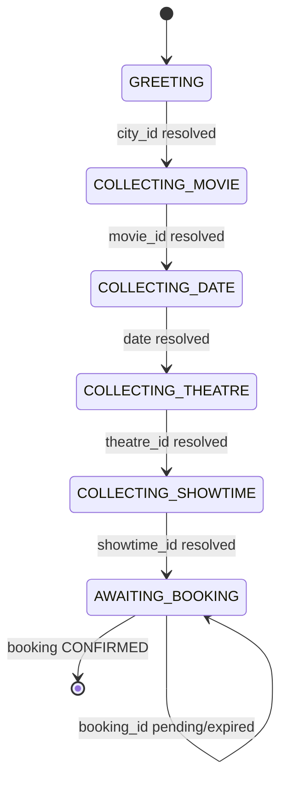
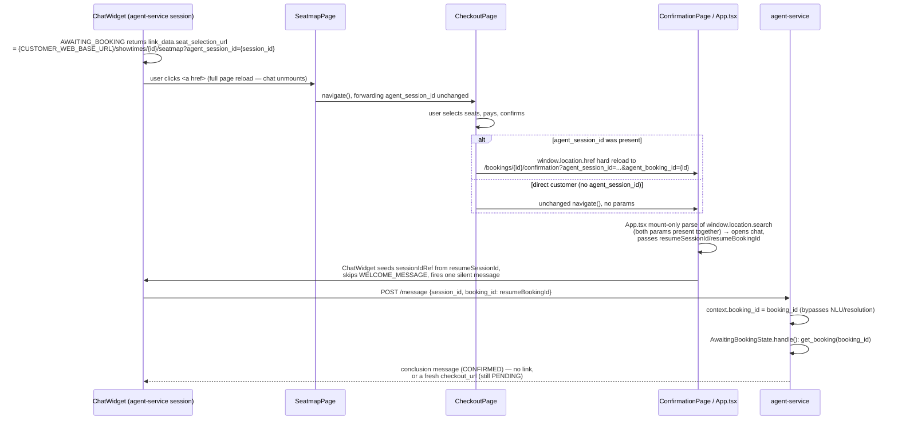

# Agent service — architecture document

A synthesized architectural reference for `services/agent-service/` (`:8007`) — read this for
"how the agent works today." `docs/ai-agent-requirements.md` is the original target design
(Option B, 9 states); `docs/agent_service_progress.md` is the chronological build log (sessions,
bugs found/fixed, open gaps). This document describes the system as it currently stands, the same
relationship `docs/architecture.md` has to `docs/design.md` for the rest of the platform.

---

## 1. Design philosophy

The agent is **not** a general reasoning LLM loosely calling tools. It is a deterministic state
machine that owns every fact and every decision; a local LLM (Llama 3.2 3B via Ollama) is called at
most **twice per turn**, for two narrow, bounded jobs:

1. **NLU** (`nlu.py`) — free text → a flat JSON dict of candidate field values. Never resolves
   anything against the platform, never writes an id, never decides what to say next.
2. **Articulation** (`responder.py`) — the state machine's already-decided template text → the same
   facts, reworded for tone. Instructed not to add/remove/invent a fact; falls back to the literal
   template text on any failure.

Every fact in a response — which city matched, what date is real, what a showtime costs — is
produced by plain Python validating against the real platform. The LLM can misfire (return
nothing, echo a few-shot example, mangle a proper noun while rephrasing) without ever causing the
agent to hallucinate a booking detail — at worst it asks the same question again or sounds slightly
stiff, because the literal template text is always a safe fallback.

---

## 2. Module map

| File | Responsibility |
|---|---|
| `main.py` | FastAPI app. `GET /health`, `POST /message` — the only route, the one place all three turn kinds (free text / button click / out-of-band booking status) are dispatched. |
| `nlu.py` | LLM call #1. `extract(message) -> dict` — `{"city", "movie", "theatre", "date", "count", "showtime"}`, raw text only, `temperature=0`. Fails closed (all-`None`) on any error. |
| `resolution.py` | Deterministic, stdlib-only (`difflib`). `resolve(entities) -> dict` — re-categorizes/normalizes a misrouted NLU fragment (e.g. a theatre name landing in `entities["city"]`) against the platform's real combined city+movie+theatre name pool. `date`/`count` pass through untouched. |
| `dialogue_manager.py` | The state machine itself: `DialogueState` (ABC), one subclass per state, `DialogueStateMachine` (dispatcher), `Orchestrator` (turn sequencing + cross-state correction-clearing), module-level `handle()`. See §3–§5. |
| `responder.py` | LLM call #2. `articulate(template_text) -> str` — rephrase-only, `temperature=0.3`. Falls back to the literal input on any failure. |
| `context.py` | `BookingContext` dataclass — `session_id`, `user_id`, `city_id`, `movie_id`, `date`, `theatre_id`, `showtime_id`, `count`, `seat_ids`, `booking_id`. Resolved values only (real ids/dates) — never written directly from free text. |
| `states.py` | `State(str, Enum)` — six identifiers, no behavior. |
| `session_store.py` | In-memory `dict[str, tuple[State, BookingContext]]` + a lock, alive for the process's lifetime. No expiry. |
| `platform_client.py` | Thin `httpx` wrapper over the platform, called through routing only: `list_cities`, `list_movies`, `list_theatres`, `list_showtimes_for_movie`, `get_booking`. Raises `PlatformUnavailableError` on timeout/non-2xx (except `get_booking`'s 404, which is `None`, not an error). |
| `config.py` | Pure leaf module (`import os` only) — every env-derived value/magic number, same per-service convention as the rest of the platform. |

---

## 3. The state machine

Six states, each owning exactly one `BookingContext` slot:



| State | Owns | Validates against |
|---|---|---|
| `GREETING` | `city_id` | `list_cities()` |
| `COLLECTING_MOVIE` | `movie_id` | `list_movies(city_id)` — currently-playing only |
| `COLLECTING_DATE` | `date` | Real calendar dates in `list_showtimes_for_movie(movie_id, city_id)` |
| `COLLECTING_THEATRE` | `theatre_id` | Theatres in `list_showtimes_for_movie(...)` actually screening the movie |
| `COLLECTING_SHOWTIME` | `showtime_id` | Showtimes at `theatre_id`, narrowed by `date` |
| `AWAITING_BOOKING` | `booking_id` | `get_booking(booking_id)` — never written from entities, only by `main.py` from an out-of-band signal (§6) |

Each state's `handle(context, entities)` returns `(resolved, message, options, link_data)`:

- **`resolved`** — `True` once this state's own slot is settled this turn; the orchestrator may
  move to the next state. `AWAITING_BOOKING` is always `resolved=True` (nothing past it blocks the
  walk).
- **`message`** — this state's own text only, empty when nothing changed (already settled, or a
  silent no-op).
- **`options`** — the exact real values (city names, movie titles, formatted date/showtime labels)
  this state is enumerating, for a UI to render as clickable buttons. A single real candidate is
  still presented as a one-item list requiring an explicit click — no state auto-resolves on a
  candidate count of one.
- **`link_data`** — only ever populated by `AwaitingBookingState`, a hand-off URL. Never passed
  through `responder.articulate()` (a mangled URL is a broken link, not just odd phrasing) — merged
  into the response's `extra` only *after* articulation runs.

### `Orchestrator.process()`

Always walks the **full priority list from `GREETING`**, every turn, regardless of which state the
session is "currently" parked at — never resumes from a stored "current state." This is what makes
correcting an *earlier* slot from a *later* point in the conversation work uniformly for every
slot: each state's own resolved-check (matched-and-unchanged → silent pass-through, matched-and-
*different* → a correction, handled identically to a first answer) already makes a correction free,
with no separate correction-path needed. The walk stops at the first state that isn't resolved this
turn — nothing later has anything useful to do until that slot is filled.

**Cascading clears** — correcting an upstream slot invalidates whatever was picked downstream of
it. Doing this in the orchestrator (rather than each state independently guessing what's downstream
of it) keeps every state one-slot-one-responsibility:

| Slot corrected | Clears |
|---|---|
| `city_id` | `movie_id`, `date`, `theatre_id`, `showtime_id`, `booking_id` |
| `movie_id` | `date`, `theatre_id`, `showtime_id`, `booking_id` |
| `date` | `theatre_id`, `showtime_id`, `booking_id` |
| `theatre_id` | `showtime_id`, `booking_id` |
| `showtime_id` | `booking_id` |

`date` is cleared on a `city_id`/`movie_id` correction because `list_showtimes_for_movie`'s real
dates are scoped by `city_id`+`movie_id` — a date picked against the old movie/city may not even be
real for the new one. `booking_id` is cleared at the exact point of *every* upstream correction
(not only deduced once the walk reaches `COLLECTING_SHOWTIME`'s own block), since an upstream
correction often makes the same turn's walk stop earlier — re-asking "which theatre," say — which
would never reach a downstream-only clearing block at all.

`Orchestrator` also resolves a named theatre to its home city before the walk starts
(`_resolve_city_from_theatre`) — `GreetingState` only ever reads `entities["city"]`, so a
theatre-derived city is injected there rather than `CollectingTheatreState` writing `context.city_id`
itself, which would break the one-state-one-slot rule.

---

## 4. One turn, end to end

`main.py`'s `POST /message` is the only route. Every turn is exactly one of three kinds:

```mermaid
sequenceDiagram
  participant U as User / customer-web
  participant M as main.py
  participant N as nlu.py
  participant R as resolution.py
  participant D as dialogue_manager (Orchestrator)
  participant P as platform_client (→ routing → catalog/theatre/booking)
  participant A as responder.py

  U->>M: POST /message {session_id, message, selected_option?, booking_id?}
  M->>M: session_store.get_or_create(session_id)

  alt free text (selected_option and booking_id both absent)
    M->>N: extract(message)
    N->>N: Ollama call #1 (temperature=0)
    N-->>M: entities {city, movie, theatre, date, count, showtime}
    M->>R: resolve(entities)
    R->>P: list_cities() / list_movies() / list_theatres()
    R-->>M: entities (re-categorized/normalized)
  else button click (selected_option set)
    M->>D: entities_from_selected_option(state_before, selected_option)
    Note over M,D: writes the click straight into the slot<br/>the previous turn's options belonged to —<br/>no LLM call, no ambiguity
  else returning browser tab (booking_id set)
    M->>M: context.booking_id = body.booking_id
    Note over M: out-of-band status update, not user input —<br/>bypasses NLU/resolution entirely
  end

  M->>D: handle(context, entities)
  loop priority order: GREETING..AWAITING_BOOKING
    D->>P: list_cities/list_movies/list_showtimes_for_movie/get_booking (this state's own check)
    P-->>D: real platform data
    D->>D: match against context's current value;<br/>write a correction or silently pass through
    D->>D: cascading clear of downstream slots, if this state's value just changed
    alt this state did not resolve this turn
      D-->>M: stop here — (state, message-so-far, options, link_data)
    end
  end
  D-->>M: (final_state, composed message, options, link_data)

  M->>A: articulate(message)
  A->>A: Ollama call #2 (temperature=0.3), rephrase only
  A-->>M: response text (or the literal input, on failure)
  M->>M: session_store.set_state(session_id, final_state)
  M-->>U: {response, state, options, extra: {entities, ...link_data}}
```

Up to two LLM calls per turn (free-text path), one (articulate only) on the button/booking_id
paths — neither call ever decides a fact or calls a platform API.

---

## 5. Structured options (clickable buttons)

Every unresolved state's response carries `options: list[str]` — the exact real values it's already
enumerating in its prose. A UI renders these as buttons; clicking one sends `selected_option`
instead of typed text. `main.py` detects this and calls
`dialogue_manager.entities_from_selected_option(state_before, selected_option)`, which writes the
literal clicked text straight into the slot the *previous* turn's options belonged to:

```python
_OPTION_FIELD_BY_STATE = {
    State.GREETING: "city",
    State.COLLECTING_MOVIE: "movie",
    State.COLLECTING_DATE: "date",
    State.COLLECTING_THEATRE: "theatre",
    State.COLLECTING_SHOWTIME: "showtime",
}
```

This is the only path that ever resolves `COLLECTING_SHOWTIME` from free text in practice — there's
no NLU field or parsing for an arbitrary typed time-of-day phrase ("6pm", "the early show"),
deliberately scoped out; buttons are the deterministic alternative once date-narrowing alone leaves
more than one candidate. Every other state's slot can be corrected by *either* a click or typed free
text, handled identically by the state's own match-and-write logic (§3).

`apps/customer-web/src/components/ChatWidget/MessageList.tsx` renders the latest agent message's
`options` as buttons, disabled while a request is in flight; the moment any answer is given (click
or typed text), every earlier message's options are cleared so a stale button can't be
double-clicked during the in-flight gap.

---

## 6. Chat-to-browser booking hand-off

Seat selection and payment are **not** reimplemented in chat — `AWAITING_BOOKING` hands off to
customer-web's existing seatmap → checkout → confirmation pages with a real link, then learns the
outcome via a return-to-chat redirect that only fires when the flow was actually started from the
chat (a customer browsing those pages directly sees zero behavior change).



`AwaitingBookingState` is the only code that knows the seatmap/checkout URL shapes and the only
call site for `get_booking()`. It branches on the booking's status:

| `booking_id` / status | Response |
|---|---|
| `None` (never handed off) | Offer `seat_selection_url` |
| `get_booking` raises `PlatformUnavailableError` | "temporarily unavailable," no link |
| `None` returned (404/unknown id) | Clear `booking_id`, offer `seat_selection_url` again |
| `CONFIRMED` | Conclude — no link, nothing left to do |
| `PENDING` | Offer `checkout_url` |
| `EXPIRED` / `CANCELLED` | Clear `booking_id`, re-offer `seat_selection_url` with an explanatory prefix |

`apps/customer-web/src/App.tsx` lives outside `<Routes>` and never unmounts across *client-side*
navigation, but a hard reload (the checkout→confirmation step) destroys it — continuity rides in the
URL query string (`agent_session_id`/`agent_booking_id`), not in memory.

---

## 7. What the LLM is never trusted with

- **Facts.** Every name, id, date, and price in a response comes from a real platform call or
  `context`, never from either LLM call's own text.
- **Decisions.** Which state runs next, whether a match is valid, what to ask — all plain Python
  against real platform data.
- **Structural data.** A hand-off URL is computed by `AwaitingBookingState` and travels through
  `link_data`, never through `responder.articulate()` — articulation only ever sees prose meant to
  be reworded, never a string where exact characters matter.
- **Session identity.** `context.session_id`/`booking_id` are written by `main.py` from the request
  itself, never extracted from a message.

This means a flaky or adversarial model response can degrade the conversation (ask again, sound
stiff, miss an extraction) but cannot fabricate a booking detail, leak a different session's data,
or smuggle a fact past the deterministic layer.

---

## 8. Current gaps and where to look next

This document describes the architecture as built; it is not a complete account of known
limitations, in-flight NLU reliability issues, or what the next session should pick up — see
`docs/agent_service_progress.md` for all of that (kept up to date per session) and
`docs/ai-agent-requirements.md` for the original 9-state target design this is incrementally
growing toward.
