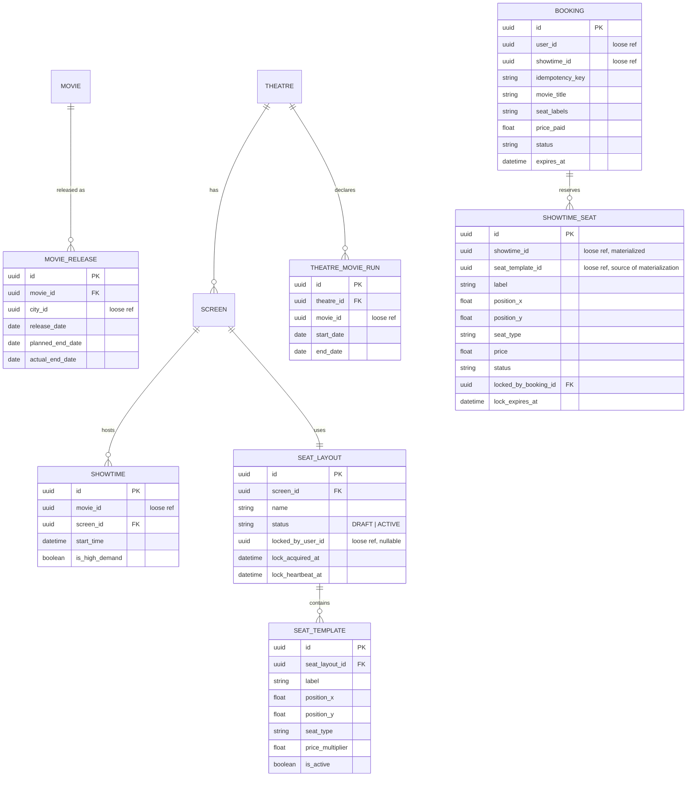

# Movie ticket booking system — design document (v8, production-oriented)

A BookMyShow-style platform, designed for production deployment. Python/FastAPI microservices, database-per-service, built around SOLID principles and a small set of deliberately-chosen patterns, sized against a stated DAU target.

v5 changes from v4: Customer and Admin web apps added to the architecture; a new admin-facing API surface across catalog and theatre services with role-based auth; and a concrete workflow (and Builder-pattern implementation) for creating seat layouts and seat templates.

v6 changes from v5: the static content server and the asset service, previously conflated into one local-only component, were split into two — later merged back in v7 for a different, better-justified reason.

v7 changes from v6: seat layout became fully freeform (id/label/x/y instead of row/column, authored via a canvas-based admin tool); the static content server and asset service were merged back into one local-only "local CDN mock" component; the routing service was retained for local setup with authentication disabled and made explicitly swappable for a real API gateway in production.

v8 changes from v7: the failure-scenario coverage gap for admin operations is closed — a pessimistic edit lock (heartbeat-based, no fixed TTL) prevents concurrent edits to the same draft seat layout; seat materialization on showtime creation now has explicit fail-closed retry behavior; publish is stated as a single transaction; showtime deletion's check-then-act race against in-flight bookings is tightened, with the larger question of cancellation-with-consequences explicitly flagged as out of scope; and soft-delete's non-cascading behavior toward already-scheduled showtimes and existing bookings is stated outright rather than left as an unverified assumption.

---

## 1. Requirements recap

**Functional** — browse movies → pick theatre/showtime → seat map → lock seats 10 minutes → pay (mocked, always succeeds) → confirm. Lock auto-releases on timeout. Movies have release/end dates, city-level and optionally per theatre (§4.4). Customer and admin web apps (§3), the latter backed by a dedicated admin API surface (§5.5) including a freeform seat-layout authoring tool (§4.5) with exclusive-edit protection (§4.6).

**Non-functional**:
- No two users can ever book the same seat for the same showtime, including under stampede load.
- Read traffic must scale independently of write traffic.
- Theatre seat layouts are fully freeform, creatable entirely through the admin UI (§4.5), with concurrent-edit protection (§4.6).
- New payment methods, pricing rules, or notification channels must be addable without modifying booking orchestration.
- A failed or abandoned payment must never leave seats permanently locked; a crash anywhere in the flow must not leave inconsistent state — and this guarantee extends to admin operations, not just the booking hot path (§13).
- Every mutating operation across every service must be idempotent, enforced locally within each service's own database (§11).
- Authentication must be fully configurable between environments — off for local development, on for production — without changing the apps' single-entry-point architecture (§3.2).
- The system must be observable (§14) and recoverable from the failure modes in §13.

---

## 2. Capacity planning

(Unchanged.)

- 2,000,000 DAU; ~12% complete a booking/day → ~250,000 bookings/day, ~625,000 seats booked/day.
- ~6,000,000 catalog/showtime-list requests/day, ~4,000,000 seatmap views/day.
- ~30% of daily volume concentrates in a single evening peak hour; a hot-movie ticket-window opening spikes far above that for a few minutes.

| Traffic type | Daily volume | Sustained peak (req/s) | Burst peak (req/s) |
|---|---|---|---|
| Catalog/showtime browsing | ~6M | ~500 | 2,000+ (cache-absorbed) |
| Seatmap views | ~4M | ~330 | 1,500+ |
| Booking creation | ~250K | ~20 | 100–300 |
| Payment confirmation | ~250K | ~20 | 100–300 |
| Hot-showtime ticket window | n/a | n/a | thousands of requests against ~150–300 seats in seconds |

---

## 3. High-level architecture

Five production backend services, each with its own database; two web apps; one local-only CDN mock; one routing service.

| Component | Responsibility | Datastore |
|---|---|---|
| **Customer web app** | Browse, select seats, book, pay (SPA) | — |
| **Admin web app** | Manage movies, theatres, screens, seat layouts, showtimes (SPA) | — |
| Local CDN mock (local-only) | Hosts both SPA bundles and uploaded poster/banner images, in two internally separate route groups | Local filesystem (bundles) + small PostgreSQL (asset metadata) + local filesystem (asset bytes) |
| Routing service | Forwards by path prefix to backend services; same slot a real API gateway fills in production (§3.2) | — |
| User service | Auth, user profile, **role** (`CUSTOMER`/`ADMIN`) | PostgreSQL |
| Catalog service | Movies, per-city releases | PostgreSQL |
| Theatre service | Theatres, screens, seat layouts, showtimes | PostgreSQL |
| Booking service | Seat locking, booking lifecycle | PostgreSQL (source of truth) + Redis Cluster (lock layer) |
| Payment service | Mocked payment processing | PostgreSQL |

Both apps load their bundle and reference images directly from the local CDN mock. All backend API calls go through the routing service.

### 3.1 Local CDN mock

Static-bundle-hosting and uploaded-image-serving stay logically distinct internally — different storage backends, different update lifecycles — but deploy as one local process with two route groups (`/` and `/admin/` for SPA files; `/assets/*` for uploaded images, metadata-backed). Mirrors standard production practice of one CDN distribution fronting multiple origins under one domain.

### 3.2 Auth configurability

The routing service performs no authentication locally — a pure path-prefix forwarder. A real API gateway occupies the same position in production. Each backend service retains its own JWT/role-validation middleware regardless (defense in depth), gated by an `AUTH_ENABLED` flag — off everywhere locally, on everywhere in production, same code path either way.

---

## 4. Domain model and service data ownership

Each service owns a disjoint subset of entities in its own physical database; nothing crosses a database boundary with a database-enforced constraint.

### 4.1 Ownership

| Service | Owns | FK style |
|---|---|---|
| User service | `USER` (incl. `role`) | Real FKs only within its own schema. |
| Catalog service | `MOVIE`, `MOVIE_RELEASE` (per city) | Real FK `MOVIE_RELEASE.movie_id → MOVIE.id` (same DB). `MOVIE_RELEASE.city_id` is a loose reference to theatre service. |
| Theatre service | `CITY` (source of truth), `THEATRE`, `SCREEN`, `SEAT_LAYOUT`, `SEAT_TEMPLATE`, `SHOWTIME`, `THEATRE_MOVIE_RUN` | Real FKs throughout within its own DB. `SHOWTIME.movie_id` is a loose reference to catalog. |
| Booking service | `BOOKING`, `SHOWTIME_SEAT` (materialized, §4.3) | Real FK `SHOWTIME_SEAT.booking_id → BOOKING.id` once locked/booked. `BOOKING.user_id`, `BOOKING.showtime_id` are loose references. |
| Payment service | `PAYMENT` | `PAYMENT.booking_id` is a loose reference, and the natural idempotency key (§11.1). |
| Local CDN mock (local-only) | `ASSET` metadata | Not part of the production ownership model. |

`CITY` is shared reference data: theatre service owns it; catalog service keeps a small denormalized local copy.

### 4.2 Cross-service references: loose foreign keys

Cross-service references are plain UUID columns with no DB-enforced constraint, mitigated by: (1) soft-delete rather than hard-delete for catalog-type data — **and explicitly, soft-deleting a movie or theatre never cascades** to already-scheduled `SHOWTIME` rows or existing `BOOKING` records; deactivation affects catalog/browse *visibility going forward* only, not commitments already made, since bookings hold their own denormalized snapshot (below) independent of the source record's current state — (2) snapshotting critical fields into the referencing record at write time (`BOOKING` stores `movie_title`, `theatre_name`, `seat_labels`, `price_paid` directly), and (3) validating against locally materialized data rather than a live cross-service call (§4.3).

### 4.3 Materializing showtime seats

Theatre service owns the seat layout (`SCREEN → SEAT_LAYOUT → SEAT_TEMPLATE`, real-FK'd within its own DB) and creates `SHOWTIME` rows. When a showtime is created (admin API, §5.5), theatre service calls booking service's idempotent materialize endpoint (§5.3) with the standard §11.3 retry policy (bounded attempts, backoff). **If materialization still fails after retries are exhausted, showtime creation itself fails and returns an error to the admin** — fail-closed, deliberately reusing existing idempotency/retry infrastructure rather than introducing a new "showtime exists but has no seats yet" state. Once materialized, booking service writes its own local `SHOWTIME_SEAT` rows with `label`, `position_x`, `position_y`, `seat_type`, `price` copied in, plus `seat_template_id` retained as a loose reference for the uniqueness guard in §5.3.

### 4.4 Movie release and end dates

`MOVIE_RELEASE` (catalog, per city): `release_date`, `planned_end_date`, `actual_end_date`. `THEATRE_MOVIE_RUN` (theatre service): optional explicit per-theatre `start_date`/`end_date`. The operational source of truth for bookability remains whether `SHOWTIME` rows exist.

### 4.5 Creating seat layouts and seat templates — fully freeform

Seat layout has no stored structural concept of rows, columns, or groups. Every seat is an independent record: `id`, `label` (free text), `position_x`/`position_y`, `seat_type`, `price_multiplier`. Going freeform trades away free adjacency lookups (no stored "next to" relationship — would need runtime x/y proximity if ever needed, §16.2) for the ability to represent any real theatre's shape, not just clean rectangles.

The admin UI's canvas editor offers discrete placement tools — **line**, **grid**, **curve**, **single-seat** — each a client-side convenience producing entries in a flat seat list; nothing about "rows" is ever sent to or stored by the server. **Multi-select** (rubber-band or shift-click) supports bulk-editing type/price/active-status across a cluster of placed seats, since nothing is grouped server-side. This is a **Builder** pattern: each tool invocation is a discrete construction step (`addRow`, `addGrid`, `addCurve`, `addSingleSeat`) appending to one in-progress collection before a final build/save — distinct from `SeatLayoutFactory` (§7), which assembles an already-persisted layout for the booking service's read path.

Workflow: `POST /admin/seat-layouts/draft { screen_id, name, seats: [...] }` persists a flat list as `DRAFT`. The admin previews, edits (§4.6 governs who may), then `POST .../publish` finalizes to `ACTIVE` and assigns to the screen — **a single transaction**, so there is no window where the layout is active but unassigned or vice versa. `POST .../clone` copies a published layout's seats (fresh UUIDs) to a new screen.

### 4.6 Exclusive editing — draft lock

A `DRAFT` layout can be edited by exactly one admin at a time, enforced with a pessimistic lock rather than version-based conflict resolution — appropriate given how rarely two admins would realistically be editing the same theatre's layout simultaneously, and considerably simpler to reason about than merge/conflict handling.

Three nullable columns on `SEAT_LAYOUT` (meaningful only while `status = DRAFT`): `locked_by_user_id`, `lock_acquired_at`, `lock_heartbeat_at`. No fixed TTL — unlike a 10-minute seat hold, an editing session has no natural bound, so the client heartbeats every ~30 seconds to refresh `lock_heartbeat_at`, and the lock is treated as stale (reclaimable) if that goes quiet for longer than a threshold (~2 minutes, generous against network blips). No sweep worker is needed for this, deliberately unlike the booking seat lock: a stale draft lock only matters at the moment a *second* admin tries to open the same draft, so a read-time staleness check at that moment is sufficient — there's no third party waiting on it the way a customer waits on a seat.

Every draft-mutating call (`PATCH .../seats/{id}`, `publish`) checks that the caller currently holds the lock — not merely that a lock exists — so an admin who silently lost it to staleness can't still push a save through. The lock is whole-draft, not per-seat.



---

## 5. Seat locking at scale

### 5.1 Correctness layer — atomic multi-seat lock

A single Lua script (`EVAL`) checks and sets all requested seat keys (`lock:{showtime_id}:{seat_id}`, `SET NX EX 600`) in one atomic server-side round trip.

### 5.2 Distribution layer — surviving a stampede without a virtual queue (deferred, §16.1)

Lock keys omit Redis hash tags, so a single hot showtime's seats spread naturally across Redis Cluster nodes. A stampede produces fast, clean `409` conflicts — correctness guaranteed regardless (§5.1, §5.3) — rather than smooth queued admission, deferred to §16.1.

### 5.3 Defense-in-depth layer — Postgres as the actual backstop, correctly

1. **The booking race** is prevented by the conditional update, keyed on `SHOWTIME_SEAT`'s own primary key:
```sql
UPDATE showtime_seat
SET status = 'BOOKED'
WHERE id = :seat_id AND status = 'LOCKED' AND locked_by_booking_id = :booking_id;
```
2. **Duplicate materialization** (e.g. the §4.3 retried materialize call) is guarded by an unconditional unique constraint, not scoped to booking status and not keyed on the editable display label:
```sql
UNIQUE (showtime_id, seat_template_id)
```
on `SHOWTIME_SEAT`.

### 5.4 Automatic lock release — periodic sweep, single active instance

Redis TTL (`SET ... EX 600`) is sufficient on its own for a new lock attempt to succeed once a previous one expires. Read-time reconciliation treats a `SHOWTIME_SEAT` row as available if `status = 'LOCKED' AND lock_expires_at < now()`. A periodic sweep worker (every 15–30 seconds) is the sole mechanism for flipping stored state, running as a single active instance via a Postgres advisory lock (`pg_try_advisory_lock`) — N replicas for redundancy, exactly one active, automatic failover within roughly one poll interval.

```sql
SELECT id, showtime_id FROM booking
WHERE status = 'PENDING' AND expires_at < now()
ORDER BY expires_at LIMIT 500;
UPDATE booking SET status = 'EXPIRED' WHERE id = ANY(:ids);
UPDATE showtime_seat SET status = 'AVAILABLE', locked_by_booking_id = NULL, lock_expires_at = NULL
WHERE locked_by_booking_id = ANY(:ids) AND status = 'LOCKED';
```

Proof of correctness: idempotent, single-writer by construction, automatic bounded failover. Required tests: kill the active instance mid-batch; start three replicas simultaneously; race a concurrent payment-confirm against sweep selection; re-run immediately after a successful pass. Ongoing verification: sweep lag and lock-holder as metrics (§14).

---

## 6. API contracts

See Appendix A (customer-facing) and Appendix C (admin-facing). All mutating endpoints require an `Idempotency-Key` header per §11.1.

---

## 7. Design patterns applied

Strategy (`SeatLockManager`, `PricingStrategy`, `EventPublisher`), Factory (`SeatLayoutFactory`), **Builder** (`SeatLayoutBuilder`, §4.5), **Pessimistic locking** (draft edit lock, §4.6 — distinct from the booking seat lock: heartbeat-based with no fixed TTL, no sweep worker, since the access pattern and contention profile are entirely different), Repository, State, Observer/pub-sub, Saga, Chain of Responsibility, Circuit breaker, CQRS-lite, Outbox, Bulkhead.

---

## 8. SOLID principles — concrete mapping

Unchanged in substance.

```python
class SeatLocker(Protocol):
    def acquire(self, showtime_id: str, seat_ids: list[str], holder: str) -> LockResult: ...
    def release(self, showtime_id: str, seat_ids: list[str]) -> None: ...

class BookingOrchestrator:
    def __init__(self, seats: SeatRepository, locker: SeatLocker,
                 bookings: BookingRepository, payments: PaymentClient,
                 events: EventPublisher):
        self._seats, self._locker, self._bookings = seats, locker, bookings
        self._payments, self._events = payments, events

    def select_seats(self, showtime_id: str, seat_ids: list[str], user_id: str, idempotency_key: str) -> Booking:
        result = self._locker.acquire(showtime_id, seat_ids, holder=user_id)
        if not result.success:
            raise SeatsUnavailable(result.conflicting_seat_ids)
        return self._bookings.create_pending(showtime_id, seat_ids, user_id, idempotency_key)

    def confirm(self, booking_id: str, payment_id: str) -> Booking:
        booking = self._bookings.get(booking_id)
        booking.transition_to(BookingStatus.CONFIRMED)
        self._seats.mark_booked(booking.showtime_id, booking.seat_ids)
        self._locker.release(booking.showtime_id, booking.seat_ids)
        self._bookings.save(booking)
        self._events.publish(BookingConfirmed(booking_id=booking.id))
        return booking
```

---

## 9. Multi-city scalability

`CITY` is first-class (§4.1); `THEATRE` references it directly; `MOVIE_RELEASE` carries per-city release/end dates (§4.4). Catalog and showtime queries are always city-scoped. No change to seat-locking.

---

## 10. Data volume and retention

| Data | Daily growth | Notes |
|---|---|---|
| `BOOKING` rows | ~250K, ~1KB/row → ~250MB/day | Long retention (financial). |
| `PAYMENT` rows | ~250K → ~100MB/day | Same retention requirement. |
| `SHOWTIME_SEAT` rows | ~50,000 screens × ~6 showtimes × ~150 seats → **~45M rows/day, ~6.75GB/day** | Live lock-state — purge 24–48h post-showtime. |
| Catalog/theatre metadata | Negligible | — |

Bookings/payments: minimum 7 years (confirm against jurisdiction), ~12 months hot, then archived.

---

## 11. Reliability standards: idempotency and retries

### 11.1 Idempotency — database-enforced, per service, no shared store

Each service enforces idempotency via a unique constraint (or a natural business key) checked by the same atomic write: `INSERT ... ON CONFLICT (idempotency_key) DO NOTHING RETURNING *`. State-transition endpoints get idempotency from the state machine itself. No separate idempotency store.

### 11.2 Idempotency scope — local to each service

No shared idempotency service or store across service boundaries.

### 11.3 Retries

Exponential backoff with jitter, bounded attempts, only for idempotent operations. Circuit breakers prevent retry storms.

### 11.4 Redis failure handling

Single-node failure: Redis Cluster's own replica promotion plus client retry — no Postgres fallback. Full-cluster outage: fail fast with a clear retry-able error.

---

## 12. PostgreSQL HA, consistency, and scale

Primary plus N async read replicas per service; automated failover; strong consistency on the primary, eventual consistency only on explicitly-routed replica reads; date-partitioned high-volume tables; PgBouncer pooling; vertical scaling for booking's primary, horizontal read-replica scaling for catalog/theatre; WAL archiving + periodic restore drills.

---

## 13. Failure scenarios and resilience

| Failure | Behavior | Mitigation |
|---|---|---|
| Redis node failure (single shard) | Handled by Redis Cluster itself | Automatic replica promotion + client retry (§11.4). |
| Redis full-cluster outage | Booking creation fails | Fail fast, clear retry-able error, alert (§14). |
| Active reconciliation instance crashes | Sweep pauses briefly | Advisory lock auto-releases; standby takes over (§5.4). |
| Materialization retried (network blip, client retry) | Could create duplicate `SHOWTIME_SEAT` rows | `UNIQUE (showtime_id, seat_template_id)` (§5.3) rejects the duplicate. |
| Materialization fails after retries exhausted during showtime creation | Showtime would otherwise exist with no bookable seats | Showtime creation itself fails closed, returns an error to the admin (§4.3) — no orphan state. |
| Payment service down/slow | Booking stays `PENDING` | Circuit breaker; booking TTL bounds the impact. |
| Booking-confirm commit succeeds, event publish fails | Booking correctly `CONFIRMED`, notification may lag | Outbox pattern. |
| Duplicate request | Could double-charge/double-book without protection | DB-enforced idempotency (§11.1). |
| Admin publishes a layout while a showtime using the prior draft is mid-booking | Edge case in the admin authoring workflow | `ACTIVE` layouts are immutable in place — any change requires a new draft + republish, so in-flight bookings are never invalidated mid-flight. |
| Two admins attempt to open the same draft layout concurrently | Lost-update risk without protection | Draft edit lock (§4.6) — first admin acquires, second is blocked and shown the current holder. |
| Admin closes browser/loses connection without releasing the draft lock | Lock would otherwise be stuck indefinitely | Heartbeat staleness (§4.6) reclaims it automatically after ~2 minutes of silence — no manual intervention. |
| Admin attempts to delete a showtime exactly as a booking is being created against it | Check-then-act race between two different services' databases | Synchronous cross-service check at delete time, acceptable given admin-action volume is far below booking-hot-path volume. The larger question — whether showtime removal should ever be a hard delete versus a cancellation workflow with refund/notification consequences once bookings exist — is explicitly out of scope here, not assumed away. |
| Movie or theatre soft-deleted while future showtimes/bookings reference it | Could orphan or retroactively affect existing commitments | Explicitly does not cascade (§4.2) — deactivation affects catalog visibility going forward only; existing showtimes and booking snapshots are unaffected. |
| Booking service instance crash | In-flight request fails, no orphaned state | Services are stateless; lock expires via TTL. |
| Postgres primary failover | Brief write unavailability | Standard replica promotion (§12); retries per §11.3. |
| Two requests somehow race past Redis | Theoretically both believe they hold a lock | Structurally prevented — §5.3's PK-scoped conditional update. |

---

## 14. Observability (near-term follow-up, designed for now)

Metrics (request rate/latency, lock conflict rate, booking funnel drop-off, sweep lag/lock-holder, draft-lock contention rate), distributed tracing, structured logging with correlation IDs, alerting, SLOs once real traffic exists.

---

## 15. Production readiness checklist (near-term, before real traffic)

Real API gateway taking over the routing service's slot (§3.2), `AUTH_ENABLED=true` everywhere; event bus; observability stack; secrets management; CI/CD with the §5.4 concurrency test suite plus draft-lock contention tests (§4.6); the local CDN mock (§3.1) replaced by real static hosting and a real CDN + object storage.

---

## 16. Future enhancements

### 16.1 Virtual queue / waiting room for high-demand showtimes
Deferred — UX/fairness improvement, not a correctness requirement.

### 16.2 Generalizing beyond movies — multi-event-type support
Deferred. Would also be the natural place to revisit stored adjacency (§4.5) if general-admission events ever need "seats together" logic beyond runtime x/y proximity.

### 16.3 Notification resend on user request
Deferred as part of the full notification system; `BOOKING`'s denormalized snapshot already enables it.

### 16.4 Event-driven seat-release (if the periodic sweep doesn't keep up)
If sweep-lag metrics ever justify it: Redis keyspace notifications bridged through a durable stream.

### 16.5 Theatre-manager role (partial admin scope)
Deferred until there's a real operator to design the scoping model against.

### 16.6 Showtime cancellation workflow (versus hard delete)
Flagged in §13 rather than resolved: if a showtime needs to be removed after bookings already exist against it, this likely needs a real cancellation workflow (refunds, notifications) rather than the current "block deletion if bookings exist" rule. Out of scope until refunds/notifications exist to support it.

---

## Appendix A — customer-facing API contracts

**Catalog service**
```
GET  /movies?city={city}
GET  /movies/{movie_id}
```

**Theatre service**
```
GET  /movies/{movie_id}/showtimes?city=&date=
GET  /theatres/{theatre_id}
GET  /showtimes/{showtime_id}
```

**Booking service**
```
GET    /showtimes/{showtime_id}/seatmap            → [{ id, label, x, y, seat_type, price, status }, ...]
POST   /bookings                                    { showtime_id, seat_ids, user_id } → 201 PENDING | 409 conflict
GET    /bookings/{booking_id}
DELETE /bookings/{booking_id}
POST   /bookings/{booking_id}/confirm               internal, idempotent
POST   /bookings/{booking_id}/resend-confirmation   (future, §16.3)
```

**Payment service**
```
POST   /payments        { booking_id, amount } → { payment_id, status: SUCCESS }   (mocked)
GET    /payments/{payment_id}
```

**User service**
```
POST   /auth/register
POST   /auth/login → JWT (includes role claim)
GET    /users/{user_id}
```

**Local CDN mock**
```
GET  /assets/{asset_id}        → binary content
```

All mutating endpoints require an `Idempotency-Key` header (§11.1). All requests require auth only when `AUTH_ENABLED=true` (§3.2).

## Appendix B — repository structure and build order

```
movie-booking-system/
├── apps/
│   ├── customer-web/          (customer SPA)
│   └── admin-web/               (admin SPA — includes the seat-layout canvas editor, §4.5, with draft-lock UX, §4.6)
├── services/
│   ├── catalog/                  (+ /admin/* routes)
│   ├── theatre/                   (+ /admin/* routes, draft-lock enforcement)
│   ├── booking/
│   │   ├── domain/
│   │   ├── application/
│   │   ├── adapters/              (RedisSeatLocker incl. Lua script, reconciliation worker with advisory-lock leader election, PostgresBookingRepository)
│   │   └── api/                   (FastAPI routers, idempotency enforcement, AUTH_ENABLED-gated middleware)
│   ├── payment/
│   └── user/                       (role claim issuance)
├── routing/                          (no-auth local forwarder — replaced by a real API gateway per §15, §3.2)
├── local-cdn-mock/                     (local dev only — bundles + assets, two internal route groups, §3.1)
├── shared/                               (event schemas, idempotency middleware, auth/JWT validation middleware)
└── infra/                                 (docker-compose: postgres x N, redis cluster, seed data)
```

Build order: (1) catalog + theatre with seed data, plus the local CDN mock, (2) booking service seatmap endpoint and showtime-seat materialization with fail-closed retry (§4.3), (3) seat locking in isolation with the §5.4 concurrency test suite, (4) booking creation + mocked payment + confirm, idempotency from the start, (5) reconciliation sweep worker, (6) routing service in front of everything (no auth), (7) admin API + the seat-layout canvas editor (§4.5) + draft edit lock (§4.6), (8) customer web app, (9) admin web app, (10) flip `AUTH_ENABLED` on and verify in staging before the production checklist (§15). Virtual queue (§16.1), multi-event-type support (§16.2), full notification system (§16.3), event-driven seat-release (§16.4), theatre-manager role (§16.5), and a showtime cancellation workflow (§16.6) are explicitly out of this build order.

## Appendix C — admin-facing API contracts

All endpoints below require an `ADMIN` role claim when `AUTH_ENABLED=true`, and an `Idempotency-Key` header on mutating calls (§11.1).

**Catalog service**
```
POST   /admin/movies
PUT    /admin/movies/{movie_id}
DELETE /admin/movies/{movie_id}                  soft-delete, non-cascading (§4.2)
POST   /admin/movies/{movie_id}/releases         create a MOVIE_RELEASE (city, dates)
PUT    /admin/releases/{release_id}
```

**Theatre service**
```
POST   /admin/theatres
PUT    /admin/theatres/{theatre_id}
POST   /admin/theatres/{theatre_id}/screens
PUT    /admin/screens/{screen_id}

POST   /admin/seat-layouts/draft                              { screen_id, name, seats: [{id, label, x, y, seat_type, price_multiplier}, ...] } (§4.5)
POST   /admin/seat-layouts/draft/{draft_id}/lock               acquire or heartbeat-refresh the edit lock (§4.6) — 409 if held by another admin and not stale
DELETE /admin/seat-layouts/draft/{draft_id}/lock               explicit release
PATCH  /admin/seat-layouts/draft/{draft_id}/seats/{seat_id}    edit a single seat — requires holding the lock
PATCH  /admin/seat-layouts/draft/{draft_id}/seats              bulk-edit a multi-selected set — requires holding the lock
POST   /admin/seat-layouts/draft/{draft_id}/publish            finalize, assign to screen, single transaction — requires holding the lock
POST   /admin/seat-layouts/{layout_id}/clone                   { target_screen_id }

POST   /admin/showtimes                                          create showtime — triggers §4.3 seat materialization, fails closed on exhausted retries
PUT    /admin/showtimes/{showtime_id}
DELETE /admin/showtimes/{showtime_id}                            only if no active bookings — synchronous check, see §13 for the race-condition caveat
```

**Booking service (internal — called by theatre service, not exposed to the admin UI directly)**
```
POST   /internal/showtimes/{showtime_id}/materialize-seats     called by theatre service when a showtime is created (§4.3), idempotent (§5.3)
```

**Local CDN mock**
```
POST   /assets        admin-facing upload path, used when creating/editing a movie's poster
```
