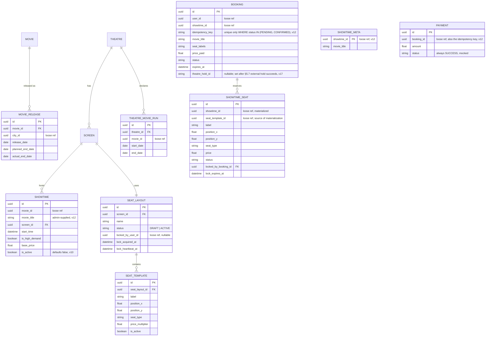

# Movie ticket booking system — design document (v9, production-oriented)

A BookMyShow-style platform, designed for production deployment. Python/FastAPI microservices, database-per-service, built around SOLID principles and a small set of deliberately-chosen patterns, sized against a stated DAU target.

v5 changes from v4: Customer and Admin web apps added to the architecture; a new admin-facing API surface across catalog and theatre services with role-based auth; and a concrete workflow (and Builder-pattern implementation) for creating seat layouts and seat templates.

v6 changes from v5: the static content server and the asset service, previously conflated into one local-only component, were split into two — later merged back in v7 for a different, better-justified reason.

v7 changes from v6: seat layout became fully freeform (id/label/x/y instead of row/column, authored via a canvas-based admin tool); the static content server and asset service were merged back into one local-only "local CDN mock" component; the routing service was retained for local setup with authentication disabled and made explicitly swappable for a real API gateway in production.

v8 changes from v7: the failure-scenario coverage gap for admin operations is closed — a pessimistic edit lock (heartbeat-based, no fixed TTL) prevents concurrent edits to the same draft seat layout; seat materialization on showtime creation now has explicit fail-closed retry behavior; publish is stated as a single transaction; showtime deletion's check-then-act race against in-flight bookings is tightened, with the larger question of cancellation-with-consequences explicitly flagged as out of scope; and soft-delete's non-cascading behavior toward already-scheduled showtimes and existing bookings is stated outright rather than left as an unverified assumption.

v9 changes from v8: idempotency keys for create-type endpoints are derived server-side from each entity's identity-defining fields (a deterministic hash) instead of a client-supplied `Idempotency-Key` header (§11.1, §6, Appendix A/C) — the client carries no key generation/retry-tracking burden. Booking creation (Phase 5) is explicitly flagged as deferred: its natural identity includes a seat-id list, which needs a canonicalization step before the same approach applies cleanly.

v10 changes from v9 (Phase 3 build-time corrections — design doc was incomplete/wrong, fixed during implementation rather than silently worked around): (1) `SEAT_TEMPLATE.price_multiplier` had no base price to multiply against anywhere in the schema — `SHOWTIME` now carries `base_price`, and `SHOWTIME_SEAT.price` is computed as `base_price * price_multiplier` at materialization time (§4.3). (2) The original `DELETE /admin/showtimes/{id}` ("only if no active bookings — synchronous check") didn't fit `SHOWTIME`'s actual shape: a `SHOWTIME` is a single point-in-time screening with no duration/end-date of its own (that's `THEATRE_MOVIE_RUN`/`MOVIE_RELEASE`'s job, §4.4), so there's nothing for an "early end date" to mean at this level, and a synchronous cross-service booking check is pointless before Phase 5 — nothing can be non-`AVAILABLE` yet. Replaced with: `SHOWTIME.is_active` defaults `false` on creation (preventing an accidentally-live showtime), a new `POST /admin/showtimes/{id}/activate` flips it `true`, and `DELETE /admin/showtimes/{id}` now flips it back to `false` rather than removing the row — no hard delete, no row-removal race to guard at all. Seat materialization (§4.3) still happens unconditionally at creation time, before activation, so a showtime can never be activated without a complete seat inventory already in place.

v11 changes from v10 (Phase 4 build-time correction): §5.1 and §5.2 as originally written contradicted each other on a real Redis Cluster — a single atomic multi-key `EVAL` (§5.1) is only atomic if every key it touches maps to the same hash slot, but §5.2 said lock keys omit hash tags specifically so one showtime's seats spread across *different* slots/nodes, which would make that same `EVAL` raise `CROSSSLOT` in production. Resolved by hash-tagging lock keys on `showtime_id` (`lock:{<showtime_id>}:<seat_id>`): one showtime's seats now always colocate on a single slot — making §5.1's atomic script safe with no `CROSSSLOT` risk — while different showtimes still land on different slots, so overall cluster-wide load still distributes normally. Sacrificing intra-showtime spreading is fine: a single shard's sequential throughput is orders of magnitude beyond even a hot-showtime stampede's burst volume (§2's worst case is thousands of req/s against ~150-300 seats, far inside one Redis instance's six-figure ops/sec capacity) — there is no realistic scenario where one showtime alone needs more than one shard's throughput.

v12 changes from v11 (Phase 5 build-time corrections — two gaps the design doc left open, resolved during the build): (1) **`BOOKING` idempotency canonicalization** (§11.1, deferred since v9): key = `sha256("|".join([showtime_id, user_id, sorted(seat_ids)-joined-by-comma]))`, lowercased, same convention as every other server-derived key. `user_id` is included so two different users requesting the same seats never hash to the same key (which would hand one user the other's booking). The constraint enforcing it is a **partial unique index** — `UNIQUE (idempotency_key) WHERE status IN ('PENDING', 'CONFIRMED')` — not a plain `UNIQUE`, because unlike `MOVIE`/`THEATRE`/etc., the same `(user, showtime, seats)` triple is a legitimate *recurring* identity: a hold expires or gets cancelled, and the same user trying the same seats again later must succeed, not be permanently deduplicated against a dead row. The partial index dedupes retries of a still-live request while freeing the key the instant a booking reaches a terminal state. (2) **`movie_title` had no path into `BOOKING`'s snapshot**: booking service only ever sees `showtime_id` and its own local `SHOWTIME_SEAT` data — `movie_id → title` lives in catalog, a hop booking has no route to without a new live cross-service call on the booking hot path. Resolved by extending the trust model `movie_id` already had (§4.2: admin-supplied, never live-validated) to `movie_title` too: `POST /admin/showtimes` (Appendix C) now also takes `movie_title`; theatre stores it and passes it through the existing `materialize-seats` call (§4.3); booking persists it in a small local cache (`SHOWTIME_META`, keyed on `showtime_id`) populated once at materialize time. Zero new live cross-service calls anywhere on the booking hot path.

v13 changes from v12 (Phase 6 build-time correction): §5.4's read-time reconciliation rule ("any seatmap read or lock attempt should treat a `SHOWTIME_SEAT` row as available if `status = 'LOCKED' AND lock_expires_at < now()`") was stated in v9 but never actually implemented in Phase 5 — `select_seats`'s availability check and `lock_seats`'s conditional `UPDATE` both only matched `status = 'AVAILABLE'`, so a seat whose hold had technically expired stayed unbookable until the sweep worker physically got to it, contradicting the stated rule. Fixed by computing the same `(status = 'AVAILABLE' OR (status = 'LOCKED' AND lock_expires_at < now()))` predicate in both places (`postgres_seat_repository.py`), so a new booking attempt can claim an effectively-abandoned seat immediately, independent of sweep timing.

v14 changes from v13 (Phase 6 build-time correction, found by trying to write §5.4's own required test 3 -- "race a concurrent payment-confirm against the sweep's selection of the same booking, confirm confirmation always wins"): Phase 5's `confirm` self-policed wall-clock expiry (`booking.is_expired()`, and `lock_expires_at > now()` in the seat UPDATE) because, at the time, nothing else ever would. That made the test literally impossible to construct -- for the sweep to select a booking as a candidate, `expires_at` must already be in the past, and `confirm`'s own check used the exact same clock comparison, so it always rejected the booking *before* any race with the sweep could happen at all. Confirmed with user: now that the sweep exists, it becomes the *sole* wall-clock authority (§5.4); `confirm` drops its clock checks entirely and gates purely on state (`status = 'PENDING'`/`'LOCKED'`), exactly matching §5.3's "the actual correctness guarantee is the conditional update... regardless of what happened upstream" framing. A `confirm` that reaches the database before the sweep's own pass now always wins, even a moment past `expires_at` -- a customer paying right at the wire, just ahead of the sweep's 15-30s poll interval, completes their purchase rather than being rejected over a technicality nothing has actually acted on yet. This also retires Phase 5's `test_confirm_fails_after_hold_expires` (its premise -- "nothing else will ever expire this" -- no longer holds); the equivalent two-part behavior (unswept expiry doesn't block confirm; confirm fails once the sweep has actually run) is covered in Phase 6's own test suite instead, in the environment that already controls the sweep deterministically.

v15 changes from v14 (Phase 7): `USER` is implemented as a table literally named `app_user`, not `user` -- `user` is a reserved word in Postgres (`CREATE TABLE user` is a syntax error outright), so every other service's "table name matches the entity name" convention has one deliberate, technically-forced exception. `POST /auth/register` also deliberately does not follow §11.1's general "a conflict on the derived/natural key returns the existing row" pattern: email is `USER`'s natural identity-defining field (like `PAYMENT.booking_id`), but password is not part of that key, so a request that conflicts on email can't be distinguished from a different person targeting an already-taken email versus a genuine retry. Returning the first registrant's row on conflict would be a real account-confusion bug, not a harmless idempotent replay -- so a conflict here is a `409`, not a `200`/`201` with the existing row.

v16 changes from v15 (Phase 8 -- the customer SPA, React+Vite+TypeScript, exposed several gaps a backend-only test suite never could): (1) three customer-facing read endpoints from Appendix A were never actually built in Phases 1-7 (browse-by-API-call never needed them) -- added `GET /cities` (theatre; no human-readable city list existed anywhere), `GET /showtimes/{id}` (theatre, plain), and enriched `GET /movies/{movie_id}/showtimes?city=&date=` (theatre, one low-frequency live call to catalog per request, confirmed acceptable) and `GET /showtimes/{id}/seatmap` (booking, wrapped with movie/theatre/screen/time/price context cached in `SHOWTIME_META` at materialize time -- §4.3's table now also carries `theatre_name`/`screen_name`/`start_time`/`base_price`, not just `movie_title` -- specifically to keep this, the system's highest-volume read path §2, free of any live cross-service call). (2) Three infrastructure gaps a real browser caught that curl-based testing structurally couldn't: the routing service had no CORS headers, so the browser silently blocked every API response from a different-origin SPA (curl never enforces CORS, hence never catching this); the local CDN mock's `StaticFiles` mount had no SPA fallback, so any direct navigation to a client-side route (e.g. a reload mid-flow) 404'd instead of serving `index.html` for React Router to handle; and Vite's default build output directory (`assets/`) collided with the CDN mock's already-documented `GET /assets/{asset_id}` route, which matched bundle filenames as attempted `asset_id` UUIDs and 422'd on every JS/CSS request -- fixed by renaming Vite's output dir (`app-assets/`) rather than touching the established `/assets` contract. (3) Confirmed with user: the post-countdown grace window (§5.6/v14 -- confirm can still succeed after the displayed countdown reaches zero, until the sweep worker actually reclaims the seat) is surfaced explicitly in the UI rather than left as an unadvertised possibility, conditional on the no-double-booking guarantee holding regardless of timing -- which Phases 4 and 6 already prove under real concurrency, so the condition holds and the UI says so.

v17 changes from v16 (Phase 9 -- the admin SPA, exposed a second, larger round of gaps the same way v16 did): (1) six admin-facing list/get endpoints were missing entirely -- not just unbuilt customer-facing ones this time, but the ability to *manage* anything that already exists: `GET /admin/movies` (catalog, includes inactive -- the customer `GET /movies` always filters to `is_active=TRUE` even with no city given, so it can't serve this), `GET /admin/movies/{id}/releases`, `GET /admin/theatres/{id}/screens`, `GET /admin/screens/{id}/seat-layouts`, `GET /admin/seat-layouts/{id}` (standalone, including current lock status -- previously only ever returned as a side effect of create/lock/publish/clone), and `GET /admin/screens/{id}/showtimes`. Confirmed with user: built all six, same reasoning as v16's gaps -- an admin UI structurally cannot manage what it cannot list. (2) A real constraint in §4.5's own contract, found while building the canvas editor: there is no endpoint to add seats to an *already-created* draft -- `PATCH .../seats/{id}` and the bulk variant only ever edit existing seats (relabel/reposition/retype/reprice/deactivate), and `POST .../draft` is the only path that ever inserts new `SEAT_TEMPLATE` rows. This is in fact consistent with §4.5's Builder framing taken literally ("each tool invocation... appending to one in-progress collection before a final build/save") rather than a bug needing a new endpoint: the canvas builds the complete flat seat list entirely client-side first (line/grid/curve/single tools, none of which touch the server), and only the first save persists it in one `POST` call. Editing an already-created draft is therefore select-and-edit-existing-seats only (no further additions) until publish. (3) Same v16-style infrastructure verification, this time for a second app under a *different* path prefix (`/admin/`, not `/`) and confirmed rather than assumed per user's explicit instruction: routing's CORS policy (`allow_origins=["*"]`, v16) and local-cdn-mock's `SPAStaticFiles` (already applied to both the `/` and `/admin` mounts, v16) both already covered admin-web with no further backend changes -- but building admin-web's own Vite config surfaced a need Vite's `base` option exists for precisely: without `base: '/admin/'`, built asset URLs in `index.html` are absolute from the domain root and 404 under a sub-path mount (customer-web, served at the root, never needed this). A related, easy-to-miss Playwright gotcha while *writing* that verification: `page.goto(url)` resolves via `new URL(url, baseURL)`, so a leading `/` in the path discards baseURL's own sub-path entirely (`new URL("/", "http://host/admin")` is `http://host/`, not `http://host/admin/`) -- caught a test that was silently exercising customer-web's bundle instead of admin-web's. Fix: baseURL needs a trailing slash, and test paths must never start with `/`. (4) A real user hit the *same underlying gap* in production-shaped traffic, not just in a test config: a bare `GET /admin` (no trailing slash) against local-cdn-mock. Starlette's `Mount("/admin", ...)` only matches `/admin/...` (its compiled path regex requires a `/` after the prefix), so a trailing-slash-less request doesn't match the admin mount at all and falls through to the catch-all `Mount("/", ...)` -- which, being itself an `SPAStaticFiles` with `html=True`, happily serves *customer-web's* `index.html` as its 404 fallback. The result looks exactly like "the admin app has no content, just a header and a link to customer-web" because that's literally what got served -- 200 OK, no error, just the wrong app entirely. Fixed with an explicit `@app.get("/admin")` redirecting to `/admin/` (307), registered before the catch-all mount so it's matched first; covered by a new infra-check E2E test. (5) A real user also hit a contrast bug once the routing fix let them actually see the app: `npm create vite`'s template `index.css` sets `color-scheme: light dark` and a `@media (prefers-color-scheme: dark)` block swapping CSS variables (`--bg`, `--text-h`, etc.) -- neither of which `App.tsx`/`App.css` (hand-written, light-only, no dark variant) ever account for. Under an OS dark preference this produced exactly white-on-white and black-on-black: native form controls (inputs/selects/buttons) silently followed the OS's dark widget theme while `App.css`'s explicit white backgrounds stayed light, and CSS-variable-driven heading colors (`--text-h`, swapped to a near-white value for dark mode) rendered against `App.css`'s white form boxes. Fixed by replacing the unused boilerplate `index.css` with a minimal reset (`box-sizing`, `body` margin/background/color, `color-scheme: light` to pin native widgets) and adding an explicit `background`/`color` to every input/select/textarea/button in `App.css` so none of them depend on native or inherited theming. customer-web's `index.css` has the identical unused boilerplate and the identical latent bug -- not fixed here (out of this phase's scope), flagged for a future pass.

v18 changes from v17 (architectural correction — the aggregator model requires two-phase seat locking, not one): The system was treating its own Redis/Postgres seat inventory as the source of truth for availability across all booking channels. A real aggregator like BookMyShow does not own the seat inventory — the theatre's own ticketing system (Vista, Moviebook, or similar) does, and the same seat is simultaneously bookable via the theatre's website, other aggregators, and box-office terminals. A second, external lock against the theatre's actual ticketing system is required alongside the existing within-platform Redis lock. The Redis lock (§5.1) continues to protect against race conditions between BookMyShow's own concurrent users (the fast, in-process layer). The new `TheatreIntegration` interface (§5.7) provides the external lock that protects against bookings on other portals. Both are required; neither replaces the other. For seatmap availability (§5.7), a sync-based shadow inventory is used: seat availability is periodically pulled from the theatre system and cached in `SHOWTIME_SEAT`, so the seatmap read path remains fast and free of live cross-service calls. The external hold call happens only at seat-selection time, making it the real-time check that actually matters. A `TheatreIntegration` mock implementation (always returns success) is wired in for local development and all existing tests — no existing test changes, only new tests for the new failure modes (§13). A new `theatre_hold_id` column is added to `BOOKING` to track the handle returned by the theatre's system, needed for confirm and release calls. Real theatre API adapters (per POS system: Vista, Moviebook, etc.) are a future enhancement, §16.8.


---

## 1. Requirements recap

**Functional** — browse movies → pick theatre/showtime → seat map → lock seats 10 minutes → pay (mocked, always succeeds) → confirm. Lock auto-releases on timeout. Movies have release/end dates, city-level and optionally per theatre (§4.4). Customer and admin web apps (§3), the latter backed by a dedicated admin API surface (§5.5) including a freeform seat-layout authoring tool (§4.5) with exclusive-edit protection (§4.6).

**Non-functional**:
- No two users can ever book the same seat for the same showtime, including under stampede load and including concurrent bookings arriving via external channels (the theatre's own website, other aggregators, box-office terminals) — §5.7's external lock addresses the cross-channel case; §5.1's Redis lock addresses the within-platform concurrent-user case.
- Read traffic must scale independently of write traffic.
- Theatre seat layouts are fully freeform, creatable entirely through the admin UI (§4.5), with concurrent-edit protection (§4.6).
- New payment methods, pricing rules, or notification channels must be addable without modifying booking orchestration.
- A failed or abandoned payment must never leave seats permanently locked; a crash anywhere in the flow must not leave inconsistent state — and this guarantee extends to admin operations, not just the booking hot path (§13).
- Every mutating operation across every service must be idempotent, enforced locally within each service's own database (§11).
- Authentication must be fully configurable between environments — off for local development, on for production — without changing the apps' single-entry-point architecture (§3.2).
- The system must be observable (§14) and recoverable from the failure modes in §13.

---

## 2. Capacity planning

(Unchanged.)

- 2,000,000 DAU; ~12% complete a booking/day → ~250,000 bookings/day, ~625,000 seats booked/day.
- ~6,000,000 catalog/showtime-list requests/day, ~4,000,000 seatmap views/day.
- ~30% of daily volume concentrates in a single evening peak hour; a hot-movie ticket-window opening spikes far above that for a few minutes.

| Traffic type | Daily volume | Sustained peak (req/s) | Burst peak (req/s) |
|---|---|---|---|
| Catalog/showtime browsing | ~6M | ~500 | 2,000+ (cache-absorbed) |
| Seatmap views | ~4M | ~330 | 1,500+ |
| Booking creation | ~250K | ~20 | 100–300 |
| Payment confirmation | ~250K | ~20 | 100–300 |
| Hot-showtime ticket window | n/a | n/a | thousands of requests against ~150–300 seats in seconds |

---

## 3. High-level architecture

Five production backend services, each with its own database; two web apps; one local-only CDN mock; one routing service.

| Component | Responsibility | Datastore |
|---|---|---|
| **Customer web app** | Browse, select seats, book, pay (SPA) | — |
| **Admin web app** | Manage movies, theatres, screens, seat layouts, showtimes (SPA) | — |
| Local CDN mock (local-only) | Hosts both SPA bundles and uploaded poster/banner images, in two internally separate route groups | Local filesystem (bundles) + small PostgreSQL (asset metadata) + local filesystem (asset bytes) |
| Routing service | Forwards by path prefix to backend services; same slot a real API gateway fills in production (§3.2) | — |
| User service | Auth, user profile, **role** (`CUSTOMER`/`ADMIN`) | PostgreSQL |
| Catalog service | Movies, per-city releases | PostgreSQL |
| Theatre service | Theatres, screens, seat layouts, showtimes | PostgreSQL |
| Booking service | Seat locking, booking lifecycle | PostgreSQL (source of truth) + Redis Cluster (lock layer) |
| Payment service | Mocked payment processing | PostgreSQL |

Both apps load their bundle and reference images directly from the local CDN mock. All backend API calls go through the routing service.

### 3.1 Local CDN mock

Static-bundle-hosting and uploaded-image-serving stay logically distinct internally — different storage backends, different update lifecycles — but deploy as one local process with two route groups (`/` and `/admin/` for SPA files; `/assets/*` for uploaded images, metadata-backed). Mirrors standard production practice of one CDN distribution fronting multiple origins under one domain.

### 3.2 Auth configurability

The routing service performs no authentication locally — a pure path-prefix forwarder. A real API gateway occupies the same position in production. Each backend service retains its own JWT/role-validation middleware regardless (defense in depth), gated by an `AUTH_ENABLED` flag — off everywhere locally, on everywhere in production, same code path either way.

---

## 4. Domain model and service data ownership

Each service owns a disjoint subset of entities in its own physical database; nothing crosses a database boundary with a database-enforced constraint.

### 4.1 Ownership

| Service | Owns | FK style |
|---|---|---|
| User service | `USER` (incl. `role`) | Real FKs only within its own schema. |
| Catalog service | `MOVIE`, `MOVIE_RELEASE` (per city) | Real FK `MOVIE_RELEASE.movie_id → MOVIE.id` (same DB). `MOVIE_RELEASE.city_id` is a loose reference to theatre service. |
| Theatre service | `CITY` (source of truth), `THEATRE`, `SCREEN`, `SEAT_LAYOUT`, `SEAT_TEMPLATE`, `SHOWTIME`, `THEATRE_MOVIE_RUN` | Real FKs throughout within its own DB. `SHOWTIME.movie_id` is a loose reference to catalog. |
| Booking service | `BOOKING`, `SHOWTIME_SEAT` (materialized, §4.3) | Real FK `SHOWTIME_SEAT.booking_id → BOOKING.id` once locked/booked. `BOOKING.user_id`, `BOOKING.showtime_id` are loose references. |
| Payment service | `PAYMENT` | `PAYMENT.booking_id` is a loose reference, and the natural idempotency key (§11.1). |
| Local CDN mock (local-only) | `ASSET` metadata | Not part of the production ownership model. |

`CITY` is shared reference data: theatre service owns it; catalog service keeps a small denormalized local copy.

### 4.2 Cross-service references: loose foreign keys

Cross-service references are plain UUID columns with no DB-enforced constraint, mitigated by: (1) soft-delete rather than hard-delete for catalog-type data — **and explicitly, soft-deleting a movie or theatre never cascades** to already-scheduled `SHOWTIME` rows or existing `BOOKING` records; deactivation affects catalog/browse *visibility going forward* only, not commitments already made, since bookings hold their own denormalized snapshot (below) independent of the source record's current state — (2) snapshotting critical fields into the referencing record at write time (`BOOKING` stores `movie_title`, `theatre_name`, `seat_labels`, `price_paid` directly), and (3) validating against locally materialized data rather than a live cross-service call (§4.3).

### 4.3 Materializing showtime seats

Theatre service owns the seat layout (`SCREEN → SEAT_LAYOUT → SEAT_TEMPLATE`, real-FK'd within its own DB) and creates `SHOWTIME` rows, each carrying its own `base_price` (v10 — see changelog) since `SEAT_TEMPLATE.price_multiplier` has nothing to multiply against on its own, and its own `movie_title` (v12 — admin-supplied alongside `movie_id` at creation, same trust tier as `movie_id` itself per §4.2: never live-validated against catalog). When a showtime is created (admin API, §5.5), theatre service computes each materialized seat's `price` as `base_price * price_multiplier` and calls booking service's idempotent materialize endpoint (§5.3) with the standard §11.3 retry policy (bounded attempts, backoff), passing `movie_title` alongside the seat list. **If materialization still fails after retries are exhausted, showtime creation itself fails and returns an error to the admin** — fail-closed, deliberately reusing existing idempotency/retry infrastructure rather than introducing a new "showtime exists but has no seats yet" state. This also guarantees a showtime can never be activated (below) with an incomplete seat inventory. Once materialized, booking service writes its own local `SHOWTIME_SEAT` rows with `label`, `position_x`, `position_y`, `seat_type`, `price` copied in, plus `seat_template_id` retained as a loose reference for the uniqueness guard in §5.3 — and upserts `movie_title` into a small local `SHOWTIME_META` cache keyed on `showtime_id` (v12), which is what later lets `BOOKING` creation (§5.6) snapshot a movie title without any live cross-service call on the booking hot path.

A newly created `SHOWTIME` defaults `is_active = false` — it exists and is fully seated, but isn't yet live. A separate `POST /admin/showtimes/{id}/activate` (Appendix C) flips it `true`. `DELETE /admin/showtimes/{id}` flips it back to `false` rather than removing the row — there is no hard delete and no row-removal race to guard against (v10; see changelog for why the original "delete only if no active bookings" contract didn't fit this entity).

### 4.4 Movie release and end dates

`MOVIE_RELEASE` (catalog, per city): `release_date`, `planned_end_date`, `actual_end_date`. `THEATRE_MOVIE_RUN` (theatre service): optional explicit per-theatre `start_date`/`end_date`. The operational source of truth for bookability remains whether `SHOWTIME` rows exist.

### 4.5 Creating seat layouts and seat templates — fully freeform

Seat layout has no stored structural concept of rows, columns, or groups. Every seat is an independent record: `id`, `label` (free text), `position_x`/`position_y`, `seat_type`, `price_multiplier`. Going freeform trades away free adjacency lookups (no stored "next to" relationship — would need runtime x/y proximity if ever needed, §16.2) for the ability to represent any real theatre's shape, not just clean rectangles.

The admin UI's canvas editor offers discrete placement tools — **line**, **grid**, **curve**, **single-seat** — each a client-side convenience producing entries in a flat seat list; nothing about "rows" is ever sent to or stored by the server. **Multi-select** (rubber-band or shift-click) supports bulk-editing type/price/active-status across a cluster of placed seats, since nothing is grouped server-side. This is a **Builder** pattern: each tool invocation is a discrete construction step (`addRow`, `addGrid`, `addCurve`, `addSingleSeat`) appending to one in-progress collection before a final build/save — distinct from `SeatLayoutFactory` (§7), which assembles an already-persisted layout for the booking service's read path.

Workflow: `POST /admin/seat-layouts/draft { screen_id, name, seats: [...] }` persists a flat list as `DRAFT`. The admin previews, edits (§4.6 governs who may), then `POST .../publish` finalizes to `ACTIVE` and assigns to the screen — **a single transaction**, so there is no window where the layout is active but unassigned or vice versa. `POST .../clone` copies a published layout's seats (fresh UUIDs) to a new screen.

### 4.6 Exclusive editing — draft lock

A `DRAFT` layout can be edited by exactly one admin at a time, enforced with a pessimistic lock rather than version-based conflict resolution — appropriate given how rarely two admins would realistically be editing the same theatre's layout simultaneously, and considerably simpler to reason about than merge/conflict handling.

Three nullable columns on `SEAT_LAYOUT` (meaningful only while `status = DRAFT`): `locked_by_user_id`, `lock_acquired_at`, `lock_heartbeat_at`. No fixed TTL — unlike a 10-minute seat hold, an editing session has no natural bound, so the client heartbeats every ~30 seconds to refresh `lock_heartbeat_at`, and the lock is treated as stale (reclaimable) if that goes quiet for longer than a threshold (~2 minutes, generous against network blips). No sweep worker is needed for this, deliberately unlike the booking seat lock: a stale draft lock only matters at the moment a *second* admin tries to open the same draft, so a read-time staleness check at that moment is sufficient — there's no third party waiting on it the way a customer waits on a seat.

Every draft-mutating call (`PATCH .../seats/{id}`, `publish`) checks that the caller currently holds the lock — not merely that a lock exists — so an admin who silently lost it to staleness can't still push a save through. The lock is whole-draft, not per-seat.



---

## 5. Seat locking at scale

### 5.1 Correctness layer — atomic multi-seat lock

A single Lua script (`EVAL`) checks and sets all requested seat keys (`lock:{<showtime_id>}:<seat_id>` — the `{...}` is a Redis hash tag, §5.2 — `SET NX EX 600`) in one atomic server-side round trip. All-or-nothing: if any requested seat is already held, none are set, and the conflicting seat IDs are returned to the caller.

### 5.2 Distribution layer — surviving a stampede without a virtual queue (deferred, §16.1)

Lock keys are hash-tagged on `showtime_id` (`lock:{<showtime_id>}:<seat_id>`, v11 — see changelog for why the original "omit hash tags" version contradicted §5.1's atomicity on a real cluster), so one showtime's seats always colocate on a single Redis Cluster slot, while different showtimes still land on different slots/nodes — overall cluster-wide load distributes normally, only a single showtime's own keys are deliberately kept together. A stampede against one showtime produces fast, clean `409` conflicts — correctness guaranteed regardless (§5.1, §5.3) — rather than smooth queued admission, deferred to §16.1; that single shard's throughput comfortably absorbs even a hot-showtime burst (§2) without needing to spread that showtime's own keys further.

### 5.3 Defense-in-depth layer — Postgres as the actual backstop, correctly

1. **The booking race** is prevented by the conditional update, keyed on `SHOWTIME_SEAT`'s own primary key:
```sql
UPDATE showtime_seat
SET status = 'BOOKED'
WHERE id = :seat_id AND status = 'LOCKED' AND locked_by_booking_id = :booking_id;
```
2. **Duplicate materialization** (e.g. the §4.3 retried materialize call) is guarded by an unconditional unique constraint, not scoped to booking status and not keyed on the editable display label:
```sql
UNIQUE (showtime_id, seat_template_id)
```
on `SHOWTIME_SEAT`.

### 5.4 Automatic lock release — periodic sweep, single active instance

Redis TTL (`SET ... EX 600`) is sufficient on its own for a new lock attempt to succeed once a previous one expires. Read-time reconciliation treats a `SHOWTIME_SEAT` row as available if `status = 'LOCKED' AND lock_expires_at < now()`. A periodic sweep worker (every 15–30 seconds) is the sole mechanism for flipping stored state, running as a single active instance via a Postgres advisory lock (`pg_try_advisory_lock`) — N replicas for redundancy, exactly one active, automatic failover within roughly one poll interval.

```sql
SELECT id, showtime_id FROM booking
WHERE status = 'PENDING' AND expires_at < now()
ORDER BY expires_at LIMIT 500;
UPDATE booking SET status = 'EXPIRED' WHERE id = ANY(:ids);
UPDATE showtime_seat SET status = 'AVAILABLE', locked_by_booking_id = NULL, lock_expires_at = NULL
WHERE locked_by_booking_id = ANY(:ids) AND status = 'LOCKED';
```

Proof of correctness: idempotent, single-writer by construction, automatic bounded failover. Required tests: kill the active instance mid-batch; start three replicas simultaneously; race a concurrent payment-confirm against sweep selection; re-run immediately after a successful pass. Ongoing verification: sweep lag and lock-holder as metrics (§14).

Implementation (Phase 6, `services/booking/adapters/reconciliation_sweep.py`): a standalone process, not wired into the FastAPI app -- its scaling/redundancy profile (N replicas, exactly one active) is independent of request-handling capacity, matching Appendix B's placement in `adapters/`, not `api/`. The booking `UPDATE` additionally guards `AND status = 'PENDING'` (not shown in the SQL above, which already assumes the rows were just read as `PENDING` and elides the obvious re-check) -- without it, a confirm that commits between the `SELECT` and the `UPDATE` within the same sweep pass would have its booking incorrectly clobbered back to `EXPIRED`; this guard is what test 3 actually verifies.

### 5.6 Booking creation, confirmation, and cancellation mechanics (Phase 5, v12)

`select_seats` (§8's `BookingOrchestrator`): checks for an existing live (`PENDING`/`CONFIRMED`) booking under the request's derived idempotency key first (§11.1) — a genuine retry returns that row directly, touching neither Redis nor `SHOWTIME_SEAT`. Only a genuinely new request acquires the Redis lock (§5.1), then inserts the `BOOKING` row, then runs a second conditional update — `SHOWTIME_SEAT` rows flip `AVAILABLE → LOCKED` (`status = 'AVAILABLE'`, scoped to the requested seat IDs) — as the Postgres-side defense-in-depth reflection of the Redis lock (§5.3's header: "Postgres as the actual backstop"). If that update's affected-row count doesn't match the requested seat count, something is inconsistent between the two layers; the Redis lock is released and the request fails closed rather than persisting a half-correct booking.

`confirm` relies on §5.3 point 1 as its *sole* concurrency primitive — no separate booking-row lock is taken first, and (v14) no clock comparison of its own either, since the sweep worker (§5.4) is the sole wall-clock authority once it exists. One transaction: `UPDATE showtime_seat SET status = 'BOOKED' WHERE showtime_id = :showtime_id AND locked_by_booking_id = :booking_id AND status = 'LOCKED' RETURNING id`, immediately followed (same transaction, same connection) by `UPDATE booking SET status = 'CONFIRMED' WHERE id = :booking_id AND status = 'PENDING' RETURNING *`. Postgres's row-level locking on the `showtime_seat` rows serializes two racing `confirm` calls for the same booking: the loser's `UPDATE` blocks until the winner's transaction commits, then re-evaluates against the now-`'BOOKED'` rows and affects zero — and because both statements share the winner's transaction, the loser is guaranteed to see the `booking` row already `'CONFIRMED'` by the time it's unblocked, not a stale `'PENDING'`. This same zero-affected-rows path is also how `confirm` wins a race against the sweep: if `confirm`'s `UPDATE` reaches the seats before the sweep's own pass does, the sweep's later, equally state-gated `UPDATE` (§5.4) simply matches nothing. A zero-affected-rows loser checks the booking's current status: `CONFIRMED` means it lost the race to a legitimate concurrent confirm and returns that row idempotently (no re-execution, no error); `EXPIRED` means the sweep won instead; anything else is a genuine inconsistency.

`DELETE /bookings/{id}` (cancel): `UPDATE booking SET status = 'CANCELLED' WHERE id = :id AND status = 'PENDING' RETURNING *`, then `SHOWTIME_SEAT` rows locked by this booking revert to `AVAILABLE` and the Redis lock is released. Only `PENDING` bookings can be cancelled this way — refunding a `CONFIRMED` booking is the same out-of-scope question §16.6 already flags.

### 5.7 Theatre integration layer — the aggregator lock (v17)

#### Why this is required

The existing Redis lock (§5.1) protects BookMyShow's own seat inventory against concurrent BookMyShow users — it is a within-platform guard. It does not protect against a user on a different channel (the theatre's own website, another aggregator, the box-office terminal) booking the same seat for the same showtime simultaneously. The theatre's ticketing system is the actual seat inventory owner; BookMyShow holds a synchronized shadow copy. A seat that appears available in BookMyShow's `SHOWTIME_SEAT` table may have already been taken in the theatre's system since the last sync. The external lock is what makes the seat hold real.

#### The two-phase lock sequence

```
1. Acquire Redis lock (§5.1)          — within-platform, <1ms, protects against BookMyShow users
2. Call theatre.hold_seats()          — external, ~100-500ms, protects against all other channels
   - Conflict → release Redis lock, return 409 with conflicting seats
   - Theatre API timeout/error → release Redis lock, return 503 (retryable)
   - Success → store theatre_hold_id on the PENDING booking row
3. Create PENDING booking              — as before
4. Customer pays                       — as before
5. Call theatre.confirm_hold()        — external, tells theatre to convert hold to a real booking
6. Confirm booking in Postgres,        — as before
   release Redis lock
```

On expiry or cancellation, the sweep worker (§5.4) and the cancel endpoint (§5.6) additionally call `theatre.release_hold(theatre_hold_id)` to free the seat in the theatre's system.

#### The TheatreIntegration interface

```python
class HoldResult:
    success: bool
    theatre_hold_id: str | None       # populated on success; opaque token from theatre's system
    conflicting_seat_ids: list[str]   # populated on conflict

class TheatreIntegration(Protocol):
    def hold_seats(self, showtime_id: str, seat_ids: list[str],
                   hold_duration_seconds: int) -> HoldResult: ...
    def confirm_hold(self, theatre_hold_id: str) -> None: ...
    def release_hold(self, theatre_hold_id: str) -> None: ...
    def sync_availability(self, showtime_id: str) -> list[SeatStatus]: ...
```

`BookingOrchestrator` takes `TheatreIntegration` as a constructor-injected dependency alongside the existing `SeatLocker`, `SeatRepository`, and `PaymentClient`. This is the same Dependency Inversion pattern already in place — no orchestrator code changes when a real adapter replaces the mock.

#### Seatmap availability — sync-based shadow inventory

The `GET /showtimes/{id}/seatmap` path (the system's highest-volume read, §2) must never make a live call to the theatre's system on every request. Instead: a background sync job (per-showtime, triggered on a configurable interval — e.g. every 60s for active showtimes, less frequently for future ones) calls `theatre.sync_availability()` and updates `SHOWTIME_SEAT` rows that have changed state externally (e.g. a seat booked via another portal). The seatmap read path serves the shadow copy as before.

Consequence: a seat taken on another portal will appear available in BookMyShow until the next sync. A user selecting that seat will get to the `hold_seats()` call and receive a conflict there — a clean 409, recoverable, mildly inconvenient. This is the standard aggregator trade-off: fast reads (from cache) with an accurate lock at selection time.

The sync job lives in `services/booking/adapters/theatre_availability_sync.py`, structured analogously to the sweep worker — N replicas, one active via Postgres advisory lock, independent of request-handling capacity.

#### Mock implementation for local development

`MockTheatreIntegration` always returns success with a generated `theatre_hold_id` (a UUID). All existing tests continue to pass unchanged — the mock is wired via the same Dependency Inversion mechanism used by the rest of the test suite (`MockSeatLocker`, etc.). New tests exercise the failure paths specifically: hold conflict, theatre API timeout, confirm failure after a successful hold.

#### BOOKING schema addition

`BOOKING.theatre_hold_id` (nullable string, v17): set when the external hold succeeds in step 2 above. Used for the `confirm_hold` and `release_hold` calls. Null only for bookings created before this feature existed (migration: add column with NULL default, no backfill needed).


---

## 6. API contracts

See Appendix A (customer-facing) and Appendix C (admin-facing). Create endpoints are idempotent via a server-derived key (§11.1) — no client-supplied `Idempotency-Key` header is required.

---

## 7. Design patterns applied

Strategy (`SeatLockManager`, `PricingStrategy`, `EventPublisher`, **`TheatreIntegration`** — same pattern, same reason: a mock for tests and local dev, real adapters per POS system in production), Factory (`SeatLayoutFactory`), **Builder** (`SeatLayoutBuilder`, §4.5), **Pessimistic locking** (draft edit lock, §4.6), Repository, State, Observer/pub-sub, **Saga** (the two-phase lock sequence in §5.7 is itself a saga: Redis lock → external hold → payment → confirm, each with a compensating release on failure), Chain of Responsibility, Circuit breaker (now applies to the theatre API calls in addition to the payment client), CQRS-lite, Outbox (now also covers the confirm-hold and release-hold retry paths, §13), Bulkhead.

---

## 8. SOLID principles — concrete mapping

Unchanged in substance.

```python
class SeatLocker(Protocol):
    def acquire(self, showtime_id: str, seat_ids: list[str], holder: str) -> LockResult: ...
    def release(self, showtime_id: str, seat_ids: list[str]) -> None: ...

class TheatreIntegration(Protocol):          # NEW — §5.7
    def hold_seats(self, showtime_id: str, seat_ids: list[str],
                   hold_duration_seconds: int) -> HoldResult: ...
    def confirm_hold(self, theatre_hold_id: str) -> None: ...
    def release_hold(self, theatre_hold_id: str) -> None: ...

class BookingOrchestrator:
    def __init__(self, seats: SeatRepository, locker: SeatLocker,
                 theatre: TheatreIntegration,          # NEW — §5.7
                 bookings: BookingRepository, payments: PaymentClient,
                 events: EventPublisher):
        self._seats, self._locker, self._theatre = seats, locker, theatre
        self._bookings, self._payments, self._events = bookings, payments, events

    def select_seats(self, showtime_id: str, seat_ids: list[str], user_id: str, idempotency_key: str) -> Booking:
        # Step 1: within-platform lock (fast, <1ms)
        lock_result = self._locker.acquire(showtime_id, seat_ids, holder=user_id)
        if not lock_result.success:
            raise SeatsUnavailable(lock_result.conflicting_seat_ids)
        # Step 2: external lock against the theatre's system (§5.7)
        hold_result = self._theatre.hold_seats(showtime_id, seat_ids, hold_duration_seconds=600)
        if not hold_result.success:
            self._locker.release(showtime_id, seat_ids)   # compensate step 1
            raise SeatsUnavailable(hold_result.conflicting_seat_ids)
        return self._bookings.create_pending(
            showtime_id, seat_ids, user_id, idempotency_key,
            theatre_hold_id=hold_result.theatre_hold_id   # store for later confirm/release
        )

    def confirm(self, booking_id: str, payment_id: str) -> Booking:
        booking = self._bookings.get(booking_id)
        booking.transition_to(BookingStatus.CONFIRMED)
        self._seats.mark_booked(booking.showtime_id, booking.seat_ids)
        self._locker.release(booking.showtime_id, booking.seat_ids)
        # confirm_hold is written to the Outbox in the same transaction as the booking confirm;
        # a relay retries it independently — see §5.7 and §13 for the failure case
        self._bookings.save(booking)
        self._events.publish(BookingConfirmed(booking_id=booking.id))
        return booking
```

---

## 9. Multi-city scalability

`CITY` is first-class (§4.1); `THEATRE` references it directly; `MOVIE_RELEASE` carries per-city release/end dates (§4.4). Catalog and showtime queries are always city-scoped. No change to seat-locking.

---

## 10. Data volume and retention

| Data | Daily growth | Notes |
|---|---|---|
| `BOOKING` rows | ~250K, ~1KB/row → ~250MB/day | Long retention (financial). |
| `PAYMENT` rows | ~250K → ~100MB/day | Same retention requirement. |
| `SHOWTIME_SEAT` rows | ~50,000 screens × ~6 showtimes × ~150 seats → **~45M rows/day, ~6.75GB/day** | Live lock-state — purge 24–48h post-showtime. |
| Catalog/theatre metadata | Negligible | — |

Bookings/payments: minimum 7 years (confirm against jurisdiction), ~12 months hot, then archived.

---

## 11. Reliability standards: idempotency and retries

### 11.1 Idempotency — database-enforced, per service, no shared store, no client-managed key

Each service enforces idempotency via a unique constraint checked by the same atomic write: `INSERT ... ON CONFLICT (idempotency_key) DO NOTHING RETURNING *`. For create-type endpoints, `idempotency_key` is **derived server-side** as a deterministic hash of the request's identity-defining fields — `MOVIE`: title + duration + language; `MOVIE_RELEASE`: movie + city + release date; `THEATRE`: city + name; `SCREEN`: theatre + name; `ASSET`: a hash of the uploaded bytes themselves (content-addressable) — rather than a client-supplied token. A genuinely retried request always re-derives the same key from the same payload and is deduplicated automatically; the client never generates, stores, or resends a key. The accepted trade-off: two distinct entities that happen to share every identity-defining field collide into one row.

`BOOKING` (Phase 5, v12): `idempotency_key = sha256("showtime_id|user_id|" + ",".join(sorted(seat_ids)))` (lowercased per the usual convention). Enforced via a **partial** unique index — `UNIQUE (idempotency_key) WHERE status IN ('PENDING', 'CONFIRMED')`, not a plain `UNIQUE` — because the same `(user, showtime, seats)` triple is a legitimate recurring identity (a hold expires or is cancelled, the same user retries the same seats later) rather than a permanently-unique entity like `MOVIE`/`THEATRE`; the partial index dedupes retries of a still-live request but frees the key once a booking reaches a terminal state. State-transition endpoints (`confirm`, cancel) get idempotency from the state machine itself — a conditional `UPDATE ... WHERE status = 'PENDING'` (§5.3-style), not a hash. No separate idempotency store.

### 11.2 Idempotency scope — local to each service

No shared idempotency service or store across service boundaries.

### 11.3 Retries

Exponential backoff with jitter, bounded attempts, only for idempotent operations. Circuit breakers prevent retry storms.

### 11.4 Redis failure handling

Single-node failure: Redis Cluster's own replica promotion plus client retry — no Postgres fallback. Full-cluster outage: fail fast with a clear retry-able error.

---

## 12. PostgreSQL HA, consistency, and scale

Primary plus N async read replicas per service; automated failover; strong consistency on the primary, eventual consistency only on explicitly-routed replica reads; date-partitioned high-volume tables; PgBouncer pooling; vertical scaling for booking's primary, horizontal read-replica scaling for catalog/theatre; WAL archiving + periodic restore drills.

---

## 13. Failure scenarios and resilience

| Failure | Behavior | Mitigation |
|---|---|---|
| Redis node failure (single shard) | Handled by Redis Cluster itself | Automatic replica promotion + client retry (§11.4). |
| Redis full-cluster outage | Booking creation fails | Fail fast, clear retry-able error, alert (§14). |
| Active reconciliation instance crashes | Sweep pauses briefly | Advisory lock auto-releases; standby takes over (§5.4). |
| Materialization retried (network blip, client retry) | Could create duplicate `SHOWTIME_SEAT` rows | `UNIQUE (showtime_id, seat_template_id)` (§5.3) rejects the duplicate. |
| Materialization fails after retries exhausted during showtime creation | Showtime would otherwise exist with no bookable seats | Showtime creation itself fails closed, returns an error to the admin (§4.3) — no orphan state. |
| Payment service down/slow | Booking stays `PENDING` | Circuit breaker; booking TTL bounds the impact. |
| Booking-confirm commit succeeds, event publish fails | Booking correctly `CONFIRMED`, notification may lag | Outbox pattern. |
| Duplicate request | Could double-charge/double-book without protection | DB-enforced idempotency (§11.1). |
| Admin publishes a layout while a showtime using the prior draft is mid-booking | Edge case in the admin authoring workflow | `ACTIVE` layouts are immutable in place — any change requires a new draft + republish, so in-flight bookings are never invalidated mid-flight. |
| Two admins attempt to open the same draft layout concurrently | Lost-update risk without protection | Draft edit lock (§4.6) — first admin acquires, second is blocked and shown the current holder. |
| Admin closes browser/loses connection without releasing the draft lock | Lock would otherwise be stuck indefinitely | Heartbeat staleness (§4.6) reclaims it automatically after ~2 minutes of silence — no manual intervention. |
| Admin "deletes" a showtime while a booking is in flight against it | N/A as of v10 — `DELETE /admin/showtimes/{id}` only flips `is_active` to `false` (§4.3); there is no row removal and therefore no check-then-act race against another service's database to guard at all | Deactivation just stops the showtime from being surfaced as bookable going forward; it doesn't touch existing `SHOWTIME_SEAT`/booking state. The larger question — what should happen to bookings already made against a showtime that gets deactivated — is the same refund/notification-consequences question already flagged out of scope in §16.6, now framed as "deactivate," not "delete." |
| Movie or theatre soft-deleted while future showtimes/bookings reference it | Could orphan or retroactively affect existing commitments | Explicitly does not cascade (§4.2) — deactivation affects catalog visibility going forward only; existing showtimes and booking snapshots are unaffected. |
| Booking service instance crash | In-flight request fails, no orphaned state | Services are stateless; lock expires via TTL. |
| Postgres primary failover | Brief write unavailability | Standard replica promotion (§12); retries per §11.3. |
| Two requests somehow race past Redis | Theoretically both believe they hold a lock | Structurally prevented — §5.3's PK-scoped conditional update. |
| Theatre API returns conflict on hold_seats (seat taken on another portal) | User's seat selection fails | Return 409 with conflicting seat IDs, release Redis lock immediately — same UX as a within-platform conflict. Shadow inventory updated on next sync so the seat shows as unavailable. |
| Theatre API times out or returns 5xx during hold_seats | Booking creation cannot proceed | Return 503 (retryable), release Redis lock. Circuit breaker trips if the theatre API is consistently degraded — fail fast rather than accumulating held Redis locks. |
| Theatre API fails during confirm_hold after payment succeeds | Booking is confirmed in BookMyShow but the theatre system may not know | Retry confirm_hold with bounded backoff (via the Outbox pattern — write the pending confirm-hold call in the same transaction as the booking confirm, a relay retries it independently). If retries are exhausted, flag for manual reconciliation — this is an ops concern, not a data-integrity one, since BookMyShow has the payment. |
| Theatre API fails during release_hold (on expiry or cancel) | Seat may stay held in the theatre's system after BookMyShow releases it | Retry release_hold with bounded backoff (same Outbox relay). Theatre systems typically have their own TTL on holds anyway — a failed release is a brief over-lock on the theatre's side, not a permanent problem. |
| theatre_hold_id is null on a confirm/cancel for a booking created before v17 | release_hold has no handle to call with | Skip the theatre API call for null theatre_hold_id — pre-v17 bookings were against the mock implementation which tracked no real holds. |

---

## 14. Observability (near-term follow-up, designed for now)

Metrics (request rate/latency, lock conflict rate, booking funnel drop-off, sweep lag/lock-holder, draft-lock contention rate), distributed tracing, structured logging with correlation IDs, alerting, SLOs once real traffic exists.

---

## 15. Production readiness checklist (near-term, before real traffic)

Real API gateway taking over the routing service's slot (§3.2), `AUTH_ENABLED=true` everywhere; event bus; observability stack; secrets management; CI/CD with the §5.4 concurrency test suite plus draft-lock contention tests (§4.6); the local CDN mock (§3.1) replaced by real static hosting and a real CDN + object storage. **Real TheatreIntegration adapters** (one per theatre POS system — see §16.8) replace the `MockTheatreIntegration` that exists locally; the interface and wiring stay unchanged.

---

## 16. Future enhancements

### 16.1 Virtual queue / waiting room for high-demand showtimes
Deferred — UX/fairness improvement, not a correctness requirement.

### 16.2 Generalizing beyond movies — multi-event-type support
Deferred. Would also be the natural place to revisit stored adjacency (§4.5) if general-admission events ever need "seats together" logic beyond runtime x/y proximity.

### 16.3 Notification resend on user request
Deferred as part of the full notification system; `BOOKING`'s denormalized snapshot already enables it.

### 16.4 Event-driven seat-release (if the periodic sweep doesn't keep up)
If sweep-lag metrics ever justify it: Redis keyspace notifications bridged through a durable stream.

### 16.5 Theatre-manager role (partial admin scope)
Deferred until there's a real operator to design the scoping model against.

### 16.8 Real TheatreIntegration adapters (per POS system)

The local development and test environment uses `MockTheatreIntegration`, which always succeeds. Production requires a concrete implementation per theatre POS system the platform integrates with (Vista, Moviebook, proprietary systems, etc.). Each adapter implements the `TheatreIntegration` Protocol (§5.7) and is responsible for: translating BookMyShow's `showtime_id`/`seat_id` space into the theatre's own identifier space; handling the theatre API's specific authentication scheme; mapping the theatre's error codes to BookMyShow's `HoldResult.success = False` / `conflicting_seat_ids` contract; and implementing `sync_availability` for the shadow-inventory sync job.

Adapter registry: `THEATRE.integration_type` (e.g. `"vista"`, `"moviebook"`, `"mock"`) determines which adapter is injected at runtime — not a code change, a configuration change, for each onboarded theatre. A theatre with `integration_type = "mock"` continues to work exactly as the system does today, which covers theatres that don't have a POS API yet (manual inventory management through the admin UI, §3).

### 16.6 Showtime cancellation workflow (versus deactivation)
Flagged in §13 rather than resolved: as of v10, "deleting" a showtime only flips `is_active` to `false` (§4.3) — there is no hard delete to reconsider. The open question is what *should* happen to bookings that already exist against a showtime that gets deactivated; that likely needs a real cancellation workflow (refunds, notifications) rather than today's "deactivation is silent and has no effect on existing bookings" behavior. Out of scope until refunds/notifications exist to support it.

---

## Appendix A — customer-facing API contracts

**Catalog service**
```
GET  /movies?city={city}
GET  /movies/{movie_id}
```

**Theatre service**
```
GET  /cities                                       v16 -- human-readable city picker, CITY had no read endpoint at all before this
GET  /theatres?city=                               Appendix A gap filled in Phase 1, see §4.1's note
GET  /theatres/{theatre_id}
GET  /movies/{movie_id}/showtimes?city=&date=      → { movie: {...}, showtimes: [...] } (v16 -- one low-frequency catalog call per request, not per seatmap view)
GET  /showtimes/{showtime_id}                      plain, theatre-only fields (v16)
```

**Booking service**
```
GET    /showtimes/{showtime_id}/seatmap            → { showtime_id, movie_title, theatre_name, screen_name, start_time, base_price, seats: [{ id, label, x, y, seat_type, price, status }, ...] } (v16 -- wrapped with cached context, not the bare array originally specified here)
POST   /bookings                                    { showtime_id, seat_ids, user_id } → 201 PENDING | 409 conflict (§5.6)
GET    /bookings/{booking_id}
DELETE /bookings/{booking_id}                       explicit cancel, PENDING only (§5.6)
POST   /bookings/{booking_id}/confirm               { payment_id } → idempotent (§5.6) -- v12 fills in the body shape "internal" left unspecified
POST   /bookings/{booking_id}/resend-confirmation   (future, §16.3)
```

**Payment service**
```
POST   /payments        { booking_id, amount } → { payment_id, status: SUCCESS }   (mocked, booking_id is the idempotency key per §4.1)
GET    /payments/{payment_id}
```

**User service**
```
POST   /auth/register
POST   /auth/login → JWT (includes role claim)
GET    /users/{user_id}
```

**Local CDN mock**
```
GET  /assets/{asset_id}        → binary content
```

Create endpoints are idempotent via a server-derived key (§11.1), not a client-supplied header. All requests require auth only when `AUTH_ENABLED=true` (§3.2).

## Appendix B — repository structure and build order

```
movie-booking-system/
├── apps/
│   ├── customer-web/          (customer SPA -- React+Vite+TypeScript, v16; e2e/ holds the Playwright suite, run against the build deployed into local-cdn-mock/static/customer, never the Vite dev server)
│   └── admin-web/               (admin SPA, v17 — includes the seat-layout canvas editor, §4.5, with draft-lock UX, §4.6; e2e/ Playwright suite run against the build deployed into local-cdn-mock/static/admin under the /admin/ prefix)
├── services/
│   ├── catalog/                  (+ /admin/* routes)
│   ├── theatre/                   (+ /admin/* routes, draft-lock enforcement)
│   ├── booking/
│   │   ├── domain/
│   │   ├── application/
│   │   ├── adapters/              (RedisSeatLocker incl. Lua script, reconciliation worker with advisory-lock leader election, PostgresBookingRepository)
│   │   └── api/                   (FastAPI routers, idempotency enforcement, AUTH_ENABLED-gated middleware)
│   ├── payment/
│   └── user/                       (role claim issuance)
├── routing/                          (no-auth local forwarder — replaced by a real API gateway per §15, §3.2)
├── local-cdn-mock/                     (local dev only — bundles + assets, two internal route groups, §3.1)
├── shared/                               (event schemas, idempotency middleware, auth/JWT validation middleware)
└── infra/                                 (docker-compose: postgres x N, redis cluster, seed data)
```

Build order: (1) catalog + theatre with seed data, plus the local CDN mock, (2) booking service seatmap endpoint and showtime-seat materialization with fail-closed retry (§4.3), (3) seat locking in isolation with the §5.4 concurrency test suite, (4) booking creation + mocked payment + confirm, idempotency from the start, (5) reconciliation sweep worker, (6) routing service in front of everything (no auth), (7) admin API + the seat-layout canvas editor (§4.5) + draft edit lock (§4.6), (8) customer web app, (9) admin web app, (9.5) TheatreIntegration interface + mock wired into booking saga + external-hold failure-mode tests, (10) flip `AUTH_ENABLED` on and verify in staging before the production checklist (§15). Virtual queue (§16.1), multi-event-type support (§16.2), full notification system (§16.3), event-driven seat-release (§16.4), theatre-manager role (§16.5), and a showtime cancellation workflow (§16.6) are explicitly out of this build order.

## Appendix C — admin-facing API contracts

All endpoints below require an `ADMIN` role claim when `AUTH_ENABLED=true`. Create endpoints are idempotent via a server-derived key (§11.1) — no client-supplied header needed.

**Catalog service**
```
GET    /admin/movies                              v17 — every movie, including inactive (unlike GET /movies)
POST   /admin/movies
PUT    /admin/movies/{movie_id}
DELETE /admin/movies/{movie_id}                  soft-delete, non-cascading (§4.2)
GET    /admin/movies/{movie_id}/releases          v17 — list a movie's releases
POST   /admin/movies/{movie_id}/releases         create a MOVIE_RELEASE (city, dates)
PUT    /admin/releases/{release_id}
```

**Theatre service**
```
POST   /admin/theatres
PUT    /admin/theatres/{theatre_id}
GET    /admin/theatres/{theatre_id}/screens                   v17 — list a theatre's screens
POST   /admin/theatres/{theatre_id}/screens
PUT    /admin/screens/{screen_id}

GET    /admin/screens/{screen_id}/seat-layouts                v17 — list a screen's draft/published layouts
GET    /admin/seat-layouts/{layout_id}                        v17 — standalone read incl. current lock status
POST   /admin/seat-layouts/draft                              { screen_id, name, seats: [{id, label, x, y, seat_type, price_multiplier}, ...] } (§4.5) — the *only* way new SEAT_TEMPLATE rows are ever created (v17: confirmed there is no "add seats to an existing draft" endpoint, by design)
POST   /admin/seat-layouts/draft/{draft_id}/lock               acquire or heartbeat-refresh the edit lock (§4.6) — 409 if held by another admin and not stale
DELETE /admin/seat-layouts/draft/{draft_id}/lock               explicit release
PATCH  /admin/seat-layouts/draft/{draft_id}/seats/{seat_id}    edit a single seat — requires holding the lock
PATCH  /admin/seat-layouts/draft/{draft_id}/seats              bulk-edit a multi-selected set — requires holding the lock
POST   /admin/seat-layouts/draft/{draft_id}/publish            finalize, assign to screen, single transaction — requires holding the lock
POST   /admin/seat-layouts/{layout_id}/clone                   { target_screen_id }

GET    /admin/screens/{screen_id}/showtimes                      v17 — list a screen's showtimes (incl. inactive, unlike the customer-facing list)
POST   /admin/showtimes                                          { movie_id, movie_title, screen_id, start_time, is_high_demand, base_price } (v12 adds movie_title) — always is_active=false, triggers §4.3 seat materialization, fails closed on exhausted retries
PUT    /admin/showtimes/{showtime_id}
POST   /admin/showtimes/{showtime_id}/activate                   flips is_active to true (v10)
DELETE /admin/showtimes/{showtime_id}                             flips is_active back to false — no row removal (v10, see §13/§16.6)
```

**Booking service (internal — called by theatre service, not exposed to the admin UI directly)**
```
POST   /internal/showtimes/{showtime_id}/materialize-seats     called by theatre service when a showtime is created (§4.3), idempotent (§5.3)
```

**Local CDN mock**
```
POST   /assets        admin-facing upload path, used when creating/editing a movie's poster
```
